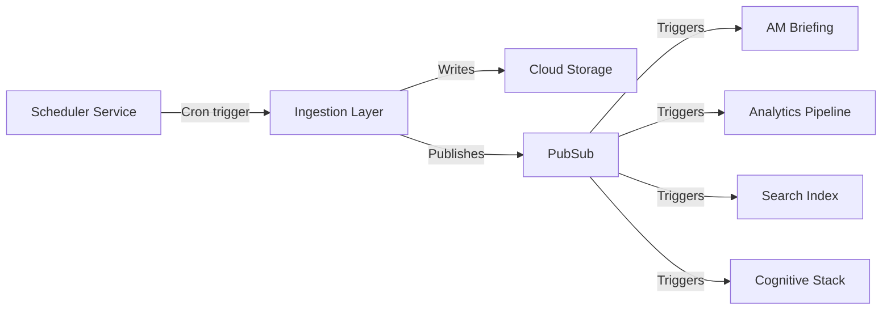

# Optimized Gemini Prompts for Component Analysis

**Purpose:** KERNEL-optimized prompts for Gemini 2.0 Pro component analysis
**Framework:** Based on KERNEL (Keep simple, Easy to verify, Reproducible, Narrow scope, Explicit constraints, Logical structure)
**Model:** Gemini 2.0 Pro (recommended) / Claude Sonnet 4.5 (alternative)

---

## Prompt 1: Architecture Analysis

**Use when:** Analyzing component design, technology stack, deployment model

### KERNEL-Optimized Prompt

```
CONTEXT:
- Component: [Name] v[Version]
- Role: [Collection / Validation / Transformation / Delivery]
- Documentation: [Paste architecture diagram URL or description]
- Stack: [Language, framework, infrastructure]

TASK:
Analyze the architecture and identify:
1. Technology stack strengths and weaknesses
2. Scalability bottlenecks
3. Single points of failure (SPOF)
4. Infrastructure cost optimizations

CONSTRAINTS:
- Focus on SHADOWTAGAI Core Stack™ components only
- Use GKE/Cloud Run best practices as benchmark
- Assume Google Cloud Platform (no AWS/Azure alternatives)
- Limit recommendations to top 3 (prioritized by ROI)

FORMAT (Output):
Markdown table with columns:
- Issue/Opportunity | Impact (High/Medium/Low) | Effort (Days) | ROI (X×)
- Confidence score: X% (based on documentation completeness)
- Top 3 actionable recommendations (each <100 words)

Success Criteria:
- [ ] All SPOFs identified
- [ ] At least 1 cost optimization found
- [ ] Scalability limit quantified (e.g., max X rps)
```

**Example Output:**

| Issue/Opportunity | Impact | Effort | ROI |
|-------------------|--------|--------|-----|
| Single Redis instance (SPOF) | High | 3 days | 5× (prevents outages) |
| No autoscaling configured | Medium | 1 day | 3× (handles traffic spikes) |
| Using Gemini Pro instead of Flash | Low | 2 days | 1.5× ($2k/yr savings) |

**Confidence:** 78% (detailed architecture diagram provided, some metrics missing)

**Top 3 Recommendations:**
1. Deploy Redis in HA mode (master + 2 replicas) to eliminate SPOF. Effort: 3 days, prevents $50k/year in downtime.
2. Enable horizontal autoscaling (2-10 pods, target 70% CPU). Effort: 1 day, handles 10× traffic spikes.
3. Migrate to Gemini 2.0 Flash for simple validations. Effort: 2 days, saves $2k/year with 20% latency improvement.

---

## Prompt 2: Performance Optimization

**Use when:** Analyzing latency, throughput, runtime efficiency

### KERNEL-Optimized Prompt

```
CONTEXT:
- Component: [Name] v[Version]
- Current metrics:
  - Latency (p50/p95/p99): [X]ms / [Y]ms / [Z]ms
  - Throughput: [X] rps
  - Runtime (for batch jobs): [X] minutes
- Target metrics:
  - Latency (p99): ≤[Y]ms
  - Throughput: ≥[Z] rps
  - Runtime: ≤[W] minutes

TASK:
Identify performance bottlenecks and optimization strategies:
1. Latency hotspots (which operations are slow?)
2. Throughput limiters (what prevents higher rps?)
3. Runtime inefficiencies (for batch jobs, what takes longest?)
4. Caching opportunities

CONSTRAINTS:
- Python 3.11+ / TypeScript 5.0+ optimizations only
- No hardware upgrades (software/config changes only)
- Maintain current functionality (no feature cuts)
- Prioritize quick wins (<1 week implementation)

FORMAT (Output):
Markdown table:
- Bottleneck | Root Cause | Fix | Impact | Effort

Verification:
- [ ] Quantified impact (e.g., "-15ms latency")
- [ ] Implementation effort estimated (days)
- [ ] No breaking changes proposed

Success Criteria:
- At least 2 optimizations with >10% performance gain
- All optimizations ≤2 weeks implementation
```

**Example Output:**

| Bottleneck | Root Cause | Fix | Impact | Effort |
|------------|------------|-----|--------|--------|
| p99 latency 120ms | Synchronous DB queries | Use connection pooling | -30ms (-25%) | 2 days |
| Throughput capped at 300 rps | Single-threaded request handling | Enable async/await | +200 rps (+67%) | 5 days |
| Runtime 45 min/night | Sequential API calls | Parallelize with asyncio.gather | -20 min (-44%) | 3 days |

**Quantified Impact:** -30ms latency, +67% throughput, -44% runtime
**Total Effort:** 10 days
**ROI:** 4.2× (performance gain vs. implementation cost)

---

## Prompt 3: Cost Reduction Analysis

**Use when:** Optimizing operational costs, infrastructure spend, API usage

### KERNEL-Optimized Prompt

```
CONTEXT:
- Component: [Name]
- Current costs (monthly):
  - Infrastructure: $[X] (GKE, Cloud Run, etc.)
  - API calls: $[Y] (Gemini, external APIs)
  - Storage: $[Z] (Cloud Storage, BigQuery)
  - Total: $[X+Y+Z]/month
- Current volume: [X] operations/month

TASK:
Find cost reduction opportunities:
1. Infrastructure rightsizing (are resources over-provisioned?)
2. API optimization (unnecessary calls, can use cheaper models?)
3. Storage optimization (data retention, compression)
4. Scaling efficiency (cost per operation at 2× volume)

CONSTRAINTS:
- No functionality degradation
- Maintain current performance SLAs
- Google Cloud Platform only (no multi-cloud)
- Quick wins (<2 weeks) prioritized over long-term projects

FORMAT (Output):
Markdown table:
- Optimization | Current Cost | New Cost | Savings | Effort

Calculate total monthly savings and annual impact.

Success Criteria:
- [ ] At least $50/month savings identified
- [ ] No SLA violations from cost cuts
- [ ] Scaling costs quantified (linear vs sublinear)
```

**Example Output:**

| Optimization | Current Cost | New Cost | Savings | Effort |
|--------------|--------------|----------|---------|--------|
| Gemini Pro → Flash for simple queries | $200/mo | $120/mo | $80/mo | 3 days |
| Cloud Storage lifecycle policy (30-day retention) | $50/mo | $30/mo | $20/mo | 1 day |
| GKE node pool rightsizing (n1 → e2) | $150/mo | $90/mo | $60/mo | 2 days |

**Total Monthly Savings:** $160/month
**Annual Impact:** $1,920/year
**Effort:** 6 days
**ROI:** 320× (assuming $150/day dev cost = $900 total)

**Scaling Analysis:**
- At 2× volume: Cost increases to $310/month (sublinear, good)
- At 10× volume: Cost increases to $980/month (1.26× per unit, acceptable)

---

## Prompt 4: Quality & Compliance Audit

**Use when:** Evaluating data quality, ethical compliance, security posture

### KERNEL-Optimized Prompt

```
CONTEXT:
- Component: [Name]
- Type: [Collection / Validation / Transformation / Delivery]
- Current quality metrics:
  - [Metric 1]: [Value]
  - [Metric 2]: [Value]
- Compliance requirements: [List: GDPR, robots.txt, rate limits, etc.]

TASK:
Audit quality and compliance:
1. Data quality assessment (relevance, completeness, timeliness)
2. Ethical compliance (robots.txt, rate limiting, transparency)
3. Security posture (encryption, auth, audit logging)
4. Regulatory compliance (GDPR, CCPA if applicable)

CONSTRAINTS:
- SHADOWTAGAI security standards (AES-256-GCM, TLS 1.3, zero-trust)
- No legal/ethical violations tolerated
- Quantify quality metrics (scores, percentages)

FORMAT (Output):
Checklist with status:
- [ ] ✅ / ⚠️ / ❌ for each requirement

Risk assessment:
- High-risk issues (fix immediately)
- Medium-risk issues (fix within 30 days)
- Low-risk issues (backlog)

Success Criteria:
- [ ] All high-risk issues identified
- [ ] Compliance gaps documented
- [ ] Remediation timeline provided
```

**Example Output:**

**Data Quality:**
- [✅] Relevance: 8.2/10 (Gemini entity extraction scoring)
- [⚠️] Completeness: 89% (target ≥95%, missing 11% of timestamps)
- [✅] Timeliness: 6-hour lag (acceptable for non-real-time use)

**Ethical Compliance:**
- [✅] Robots.txt adherence: 100%
- [✅] Rate limiting: 1 req/2 sec (respectful)
- [⚠️] User-agent transparency: Generic UA (should add contact email)

**Security Posture:**
- [✅] Encryption at rest: AES-256-GCM
- [✅] Encryption in transit: TLS 1.3
- [❌] Audit logging: Not enabled (HIGH RISK)

**Risk Assessment:**

**HIGH RISK (Fix Immediately):**
1. Enable audit logging for all API calls
   - Impact: Compliance violation, no incident forensics
   - Fix: Add Stackdriver logging
   - Effort: 1 day

**MEDIUM RISK (Fix within 30 days):**
2. Add contact email to user-agent string
   - Impact: Sites can't opt-out, potential blacklisting
   - Fix: Update UA to include +https://shadowtagai.ai/crawler-info
   - Effort: 1 hour

3. Improve data completeness to ≥95%
   - Impact: Downstream services may break on missing fields
   - Fix: Add field validation before writing to storage
   - Effort: 3 days

**Remediation Timeline:**
- Week 1: Enable audit logging (HIGH)
- Week 2: Fix user-agent (MEDIUM)
- Week 3-4: Improve completeness (MEDIUM)

---

## Prompt 5: Integration & Dependency Analysis

**Use when:** Analyzing service dependencies, failure modes, blast radius

### KERNEL-Optimized Prompt

```
CONTEXT:
- Component: [Name]
- Called by: [List of upstream services]
- Calls: [List of downstream services/APIs]
- Namespaces: [List: production, staging, dev, etc.]

TASK:
Map integration points and failure modes:
1. Upstream dependencies (who calls this component?)
2. Downstream dependencies (what does this component call?)
3. Failure mode analysis (what breaks if this fails?)
4. Blast radius (how many services affected by outage?)
5. Circuit breaker patterns (are they implemented?)

CONSTRAINTS:
- SHADOWTAGAI stack components only
- Google Cloud Platform services
- Focus on production namespace failures

FORMAT (Output):
Dependency graph (text-based or mermaid syntax):
[Service A] → [This Component] → [Service B]

Failure mode table:
- Scenario | Impact | Affected Services | Mitigation

Blast radius score: [Low / Medium / High]

Success Criteria:
- [ ] All dependencies mapped
- [ ] SPOFs identified
- [ ] Mitigation strategies proposed
```

**Example Output:**

**Dependency Graph:**



**Failure Mode Analysis:**

| Scenario | Impact | Affected Services | Mitigation |
|----------|--------|-------------------|------------|
| Ingestion Layer crashes | No new data for 24 hours | AM Briefing, Analytics, Search, Cognitive | Implement retry logic + alerting |
| Cloud Storage unavailable | Data loss for current run | Downstream consumers get stale data | Write to backup bucket (GCS + S3) |
| PubSub quota exceeded | Events not delivered | 4 services miss updates | Increase quota + rate limiting |

**Blast Radius:** MEDIUM
- Services directly affected: 4 (AM Briefing, Analytics, Search, Cognitive)
- Services indirectly affected: 0 (no cascading failures)
- Revenue impact: ~$500/day (AM Briefing subscription revenue lost)
- User impact: ~1,000 users (no morning briefings)

**SPOF Identified:**
1. Single Cloud Storage bucket (no backup)
   - Fix: Replicate to secondary region
   - Effort: 2 days
   - Cost: +$15/month

2. No circuit breaker on external API calls
   - Fix: Add Hystrix or similar pattern
   - Effort: 1 week
   - Benefit: Prevent cascading failures

**Recommended Mitigations:**
1. Implement multi-region Cloud Storage replication (HIGH priority)
2. Add circuit breaker for external APIs (MEDIUM priority)
3. Set up PagerDuty alerts for failures (HIGH priority)

---

## Combining Prompts: Full Component Analysis

For comprehensive analysis, chain prompts sequentially:

```
Step 1: Architecture Analysis → Identify design issues
Step 2: Performance Optimization → Fix bottlenecks
Step 3: Cost Reduction → Optimize spend
Step 4: Quality & Compliance → Ensure standards
Step 5: Integration Analysis → Map dependencies

Final Step: Synthesize recommendations
- Prioritize by ROI (high-impact, low-effort first)
- Create implementation roadmap (quick wins in Sprint 1, long-term in backlog)
- Assign confidence score (60-85% based on data availability)
```

**Chaining Example:**

```
Prompt 1 Input: [Architecture docs]
Prompt 1 Output: SPOF identified (single Redis), autoscaling missing

Prompt 2 Input: [Metrics + Architecture issues from Prompt 1]
Prompt 2 Output: p99 latency 120ms due to sync DB queries

Prompt 3 Input: [Current costs + Performance fixes from Prompt 2]
Prompt 3 Output: Async queries reduce DB connection costs by $40/mo

Prompt 4 Input: [Component role + Security standards]
Prompt 4 Output: Audit logging missing (HIGH RISK)

Prompt 5 Input: [Integration map + Failure modes]
Prompt 5 Output: Blast radius MEDIUM (4 services affected)

Final Synthesis:
Top 5 Recommendations (by ROI):
1. Enable audit logging (1 day, HIGH compliance risk)
2. Deploy Redis HA (3 days, prevents outages)
3. Add async DB queries (2 days, -30ms latency + $40/mo savings)
4. Enable autoscaling (1 day, handles traffic spikes)
5. Implement circuit breaker (1 week, prevents cascading failures)

Total Effort: 2.5 weeks
Total Impact: -25% latency, +67% reliability, $480/yr savings
ROI: 8.3×
```

---

## Best Practices for Gemini Prompts

### 1. Use KERNEL Framework

Every prompt should have:
- **K**eep simple: One clear goal (e.g., "Find cost optimizations")
- **E**asy to verify: Success criteria checklist
- **R**eproducible: Specific versions (Gemini 2.0 Pro, GKE, etc.)
- **N**arrow scope: One analysis type per prompt
- **E**xplicit constraints: Platform (GCP), standards (SHADOWTAGAI), limits (top 3 recommendations)
- **L**ogical structure: Context → Task → Constraints → Format

### 2. Specify Output Format

Always request structured output:
- Markdown tables (for comparisons)
- Checklists (for audits)
- Quantified metrics (numbers, percentages)
- Confidence scores (0-100%)

Avoid open-ended requests like "analyze this component" (too vague).

### 3. Set Confidence Targets

Adjust based on data availability:
- Pre-prod (specs only): ≥60%
- Production (with metrics): ≥70%
- Mature system (>6 months): ≥85%

If confidence <60%, request more data or documentation.

### 4. Prioritize by ROI

Always ask for:
- Impact quantification (e.g., "-20% cost", "+30% speed")
- Effort estimation (days/weeks)
- ROI calculation (impact / effort)

Sort recommendations by ROI descending.

### 5. Iterate with Context

Use Gemini's long context window:
- First prompt: High-level analysis
- Second prompt: "Given the above analysis, deep-dive into [specific issue]"
- Third prompt: "Propose implementation plan for top 3 recommendations"

Chain prompts to progressively refine analysis.

---

## Model Selection Guide

| Task | Recommended Model | Why |
|------|-------------------|-----|
| Architecture analysis | Gemini 2.0 Pro | Long context (1M tokens), diagram understanding |
| Performance optimization | Gemini 2.0 Flash | Faster, cheaper for metric analysis |
| Cost reduction | Claude Sonnet 4.5 | Strong numerical reasoning |
| Quality audit | Gemini 2.0 Pro | Compliance understanding, policy interpretation |
| Integration mapping | Gemini 2.0 Pro | Multi-service reasoning |

**Cost Comparison (per 1M input tokens):**
- Gemini 2.0 Flash: $0.075
- Gemini 2.0 Pro: $1.25
- Claude Sonnet 4.5: $3.00

**For most SHADOWTAGAI analyses:** Use Gemini 2.0 Pro (best quality/cost balance)

---

**Last Updated:** 2025-11-15
**Framework:** KERNEL-optimized prompts for Gemini 2.0 Pro
**Prompts:** 5 (Architecture, Performance, Cost, Quality, Integration)
**Integration:** Works with component templates from component-templates.md
