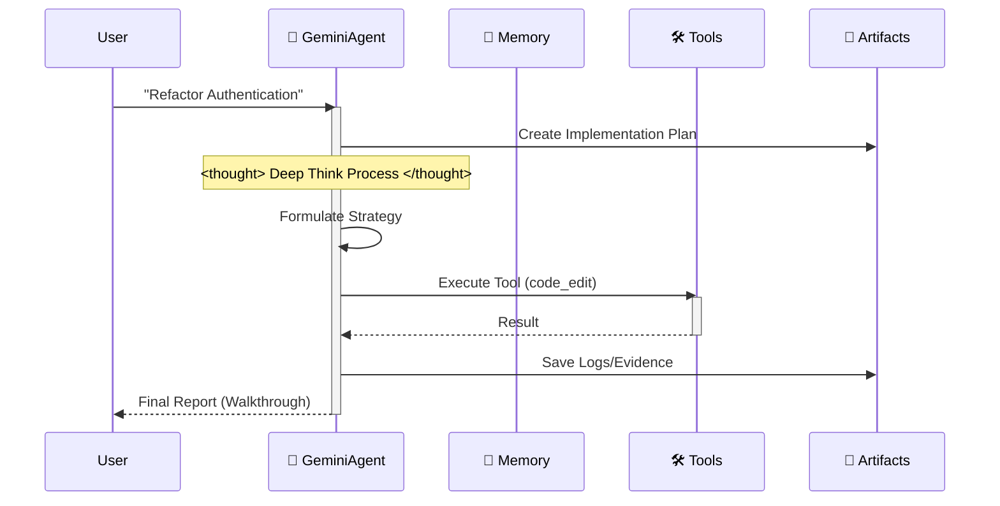
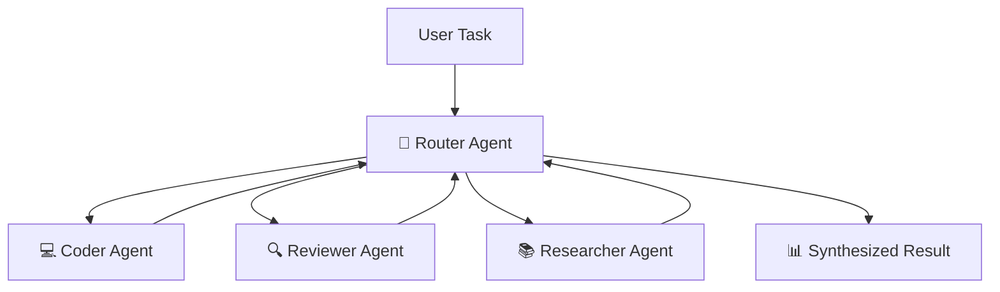
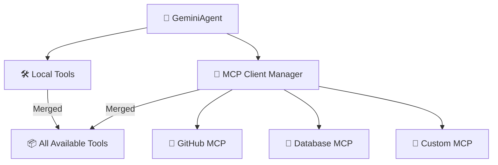

# 🪐 Google Antigravity Workspace Template (Enterprise Edition)


Welcome to the **Antigravity Workspace Template**. This is a production-grade starter kit for building autonomous agents on the Google Antigravity platform, fully compliant with **Antigravity Official Documentation**—and proudly "Anti-LangChain" thanks to its minimal, transparent architecture.


## 🌟 Project Philosophy

In an era rich with AI IDEs, I wanted to achieve an enterprise-grade architecture with just **Clone -> Rename -> Prompt**.

This project leverages the IDE's context awareness (via `.cursorrules` and `.antigravity/rules.md`) to embed a complete **Cognitive Architecture** directly into the project files.

When you open this project, your IDE is no longer just an editor; it transforms into a **"Knowledgeable" Architect**.

### Why do we need a "Thinking" Scaffold?

When using Google Antigravity or Cursor for AI development, I found a pain point:

**IDEs and models are powerful, but "empty projects" are weak.**

Every time we start a new project, we repeat boring configurations:
- "Should my code go in src or app?"
- "How do I define tool functions so Gemini recognizes them?"
- "How do I make the AI remember context?"

This repetitive labor is a waste of creativity. My ideal workflow is: **Git Clone -> IDE already knows what to do.**

So I created this project: **Antigravity Workspace Template**.

## 🧠 Core Philosophy: Artifact-First

This workspace enforces the **Artifact-First** protocol. The Agent does not just write code; it produces tangible outputs (Artifacts) for every complex task.

1. **Planning**: `artifacts/plan_[task_id].md` is created before coding.
2. **Evidence**: Logs and test outputs are saved to `artifacts/logs/`.
3. **Visuals**: UI changes generate screenshot artifacts.

## 🛸 How It Works

The agent follows a strict "Think-Act-Reflect" loop, simulating the cognitive process of Gemini 3.



## 🔥 Killer Features

- 🧠 **Infinite Memory Engine**: Recursive summarization automatically compresses history. Context limits are a thing of the past.
- 🛠️ **Universal Tool Protocol**: Generic ReAct pattern. Just register any Python function in `available_tools`, and the Agent learns to use it.
- ⚡️ **Gemini Native**: Optimized for Gemini 2.0 Flash's speed and function calling capabilities.

## 🚀 Quick Start

### Local Development
1. **Install Dependencies**:
    ```bash
    pip install -r requirements.txt
    ```
2. **Run the Agent**:
    ```bash
    python src/agent.py
    ```

### Docker Deployment
1. **Build & Run**:
    ```bash
    docker-compose up --build
    ```

## 📂 Project Structure

```
.
├── .antigravity/       # 🛸 Official Antigravity Config
│  └── rules.md        # Agent Rules & Permissions
├── artifacts/          # 📂 Agent Outputs (Plans, Logs, Visuals)
├── .context/           # AI Knowledge Base
├── .github/            # CI/CD Workflows
├── src/                # Source Code
│  ├── agent.py        # Main Agent Logic
│  ├── config.py       # Settings Management
│  ├── memory.py       # JSON Memory Manager
│  └── tools/          # Agent Tools
├── tests/              # Test Suite
├── .cursorrules        # Compatibility Pointer
├── Dockerfile          # Production Build
├── docker-compose.yml  # Local Dev Setup
└── mission.md          # Agent Objective
```

## 🚀 The "Zero-Config" Workflow

Stop writing long system prompts. This workspace pre-loads the AI's cognitive architecture for you.

### Step 1: Clone & Rename (The "Mold")
Treat this repository as a factory mold. Clone it, then rename the folder to your project name.
```bash
git clone https://github.com/study8677/antigravity-workspace-template.git my-agent-project
cd my-agent-project
# Now you are ready. No setup required.
```

### Step 2: The Magic Moment ⚡️
Open the folder in Cursor or Google Antigravity.
- 👀 **Watch**: The IDE automatically detects `.cursorrules`.
- 🧠 **Load**: The AI silently ingests the "Antigravity Expert" persona from `.antigravity/rules.md`.

### Step 3: Just Prompt (No Instructions Needed)
You don't need to tell the AI to "be careful" or "use the src folder". It's already brainwashed to be a Senior Engineer.

**Old Way (Manual Prompting)**:
> "Please write a snake game. Make sure to use modular code. Put files in src. Don't forget comments..."

**The Antigravity Way**:
> "Build a snake game."

The AI will automatically:
1. 🛑 **Pause**: "According to protocols, I must plan first."
2. 📄 **Document**: Generates `artifacts/plan_snake.md`.
3. 🔨 **Build**: Writes modular code into `src/game/` with full Google-style docstrings.

## 🗺️ Roadmap

- [x] **Phase 1: Foundation** (Scaffold, Config, Memory)
- [x] **Phase 2: DevOps** (Docker, CI/CD)
- [x] **Phase 3: Antigravity Compliance** (Rules, Artifacts)
- [x] **Phase 4: Advanced Memory** (Summary Buffer Implemented ✅)
- [x] **Phase 5: Cognitive Architecture** (Generic Tool Dispatch Implemented ✅)
- [x] **Phase 6: Dynamic Discovery** (Auto Tool & Context Loading ✅)
- [x] **Phase 7: Multi-Agent Swarm** (Router-Worker Orchestration ✅)

## 🔥 New: True Zero-Config Tool & Context Loading

**No more manual imports!** The agent now automatically discovers:

### 🛠️ Auto Tool Discovery
Drop any Python file into `src/tools/` and the agent instantly knows how to use it:

```python
# src/tools/my_custom_tool.py
def analyze_sentiment(text: str) -> str:
    """Analyzes the sentiment of given text.

    Args:
        text: The text to analyze.

    Returns:
        Sentiment score and analysis.
    """
    # Your implementation
    return "Positive sentiment detected!"
```

**That's it!** No need to edit `agent.py`. Just restart and the tool is available.

### 📚 Auto Context Loading
Add knowledge files to `.context/` and they're automatically injected:

```bash
echo "# Project Rules\nUsefriendly language." > .context/project_rules.md
```

The agent will follow these rules immediately on next run.

## 🔥 New: Multi-Agent Swarm Protocol

**Collaborate at scale!** The swarm enables multiple specialist agents to work together:

### 🪐 Architecture: Router-Worker Pattern



**Specialist Agents:**
- **Router**: Analyzes tasks, delegates to specialists, synthesizes results
- **Coder**: Writes clean, well-documented code
- **Reviewer**: Checks quality, security, best practices
- **Researcher**: Gathers information and insights

### 🚀 Usage

**Run the interactive demo:**
```bash
python -m src.swarm_demo
```

**Use in your code:**
```python
from src.swarm import SwarmOrchestrator

swarm = SwarmOrchestrator()
result = swarm.execute("Build a calculator and review it for security")
print(result)
```

**Example output:**
```
🧭 [Router] Analyzing task...
📤 [Router → Coder] Build a calculator
💻 [Coder] Creating calculator implementation...
✅ [Coder] Done!
The agent follows a strict "Think-Act-Reflect" loop, simulating the cognitive process of Gemini 3.


## 🔥 Killer Features

- 🧠 **Infinite Memory Engine**: Recursive summarization automatically compresses history. Context limits are a thing of the past.
- 🛠️ **Universal Tool Protocol**: Generic ReAct pattern. Just register any Python function in `available_tools`, and the Agent learns to use it.
- ⚡️ **Gemini Native**: Optimized for Gemini 2.0 Flash's speed and function calling capabilities.

## 🚀 Quick Start

### Local Development
1. **Install Dependencies**:
    ```bash
    pip install -r requirements.txt
    ```
2. **Run the Agent**:
    ```bash
    python src/agent.py
    ```

### Docker Deployment
1. **Build & Run**:
    ```bash
    docker-compose up --build
    ```

## 📂 Project Structure

```
.
├── .antigravity/       # 🛸 Official Antigravity Config
│  └── rules.md        # Agent Rules & Permissions
├── artifacts/          # 📂 Agent Outputs (Plans, Logs, Visuals)
├── .context/           # AI Knowledge Base
├── .github/            # CI/CD Workflows
├── src/                # Source Code
│  ├── agent.py        # Main Agent Logic
│  ├── config.py       # Settings Management
│  ├── memory.py       # JSON Memory Manager
│  └── tools/          # Agent Tools
├── tests/              # Test Suite
├── .cursorrules        # Compatibility Pointer
├── Dockerfile          # Production Build
├── docker-compose.yml  # Local Dev Setup
└── mission.md          # Agent Objective
```

## 🚀 The "Zero-Config" Workflow

Stop writing long system prompts. This workspace pre-loads the AI's cognitive architecture for you.

### Step 1: Clone & Rename (The "Mold")
Treat this repository as a factory mold. Clone it, then rename the folder to your project name.
```bash
git clone https://github.com/study8677/antigravity-workspace-template.git my-agent-project
cd my-agent-project
# Now you are ready. No setup required.
```

### Step 2: The Magic Moment ⚡️
Open the folder in Cursor or Google Antigravity.
- 👀 **Watch**: The IDE automatically detects `.cursorrules`.
- 🧠 **Load**: The AI silently ingests the "Antigravity Expert" persona from `.antigravity/rules.md`.

### Step 3: Just Prompt (No Instructions Needed)
You don't need to tell the AI to "be careful" or "use the src folder". It's already brainwashed to be a Senior Engineer.

**Old Way (Manual Prompting)**:
> "Please write a snake game. Make sure to use modular code. Put files in src. Don't forget comments..."

**The Antigravity Way**:
> "Build a snake game."

The AI will automatically:
1. 🛑 **Pause**: "According to protocols, I must plan first."
2. 📄 **Document**: Generates `artifacts/plan_snake.md`.
3. 🔨 **Build**: Writes modular code into `src/game/` with full Google-style docstrings.

## 🗺️ Roadmap

- [x] **Phase 1: Foundation** (Scaffold, Config, Memory)
- [x] **Phase 2: DevOps** (Docker, CI/CD)
- [x] **Phase 3: Antigravity Compliance** (Rules, Artifacts)
- [x] **Phase 4: Advanced Memory** (Summary Buffer Implemented ✅)
- [x] **Phase 5: Cognitive Architecture** (Generic Tool Dispatch Implemented ✅)
- [x] **Phase 6: Dynamic Discovery** (Auto Tool & Context Loading ✅)
- [x] **Phase 7: Multi-Agent Swarm** (Router-Worker Orchestration ✅)
- [x] **Phase 8: MCP Integration** (Model Context Protocol ✅) - *Implemented by [@devalexanderdaza](https://github.com/devalexanderdaza)*
- [ ] **Phase 9: Enterprise Core** (The "Agent OS" Vision)
  - [ ] **Sandbox Environment**: Safe code execution (e.g., E2B or local Docker) for high-risk operations.
  - [ ] **Orchestrated Flows**: Structured, parallel execution pipelines (DAGs) for complex tasks.

## 🔌 New: MCP (Model Context Protocol) Integration

**Connect to any MCP server!** The agent now supports the [Model Context Protocol](https://modelcontextprotocol.io/), enabling seamless integration with external tools and services.

### 🌐 What is MCP?

MCP is an open protocol that standardizes how AI applications connect to external data sources and tools. With MCP integration, your Antigravity agent can:

- 🔗 Connect to multiple MCP servers simultaneously
- 🛠️ Use any tools exposed by MCP servers
- 📊 Access databases, APIs, filesystems, and more
- 🔄 All transparently integrated with local tools

### 🚀 Quick Setup

**1. Enable MCP in your `.env`:**
```bash
MCP_ENABLED=true
```

**2. Configure servers in `mcp_servers.json`:**
```json
{
  "servers": [
    {
      "name": "github",
      "transport": "stdio",
      "command": "npx",
      "args": ["-y", "@modelcontextprotocol/server-github"],
      "enabled": true,
      "env": {
        "GITHUB_PERSONAL_ACCESS_TOKEN": "${GITHUB_TOKEN}"
      }
    }
  ]
}
```

**3. Run the agent:**
```bash
python src/agent.py
```

The agent will automatically:
- 🔌 Connect to configured MCP servers
- 🔍 Discover available tools
- 📦 Register them alongside local tools

### 🏗️ Architecture



### 📡 Supported Transports

| Transport | Description | Use Case |
|-----------|-------------|----------|
| `stdio` | Standard I/O | Local servers, CLI tools |
| `http` | Streamable HTTP | Remote servers, cloud services |
| `sse` | Server-Sent Events | Legacy HTTP servers |

### 🛠️ Built-in MCP Helper Tools

The agent includes helper tools for MCP management:

```python
# List all connected MCP servers
list_mcp_servers()

# List available MCP tools
list_mcp_tools()

# Get help for a specific tool
get_mcp_tool_help("mcp_github_create_issue")

# Check server health
mcp_health_check()
```

### 📋 Pre-configured Servers

The `mcp_servers.json` includes ready-to-use configurations for:

- 🗂️ **Filesystem**: Local file operations
- 🐙 **GitHub**: Repository management
- 🗃️ **PostgreSQL**: Database access
- 🔍 **Brave Search**: Web search
- 💾 **Memory**: Persistent storage
- 🌐 **Puppeteer**: Browser automation
- 💬 **Slack**: Workspace integration

Just enable the ones you need and add your API keys!

### 🔧 Creating Custom MCP Servers

You can also create your own MCP servers using the [MCP Python SDK](https://github.com/modelcontextprotocol/python-sdk):

```python
from mcp.server.fastmcp import FastMCP

mcp = FastMCP("My Custom Server")

@mcp.tool()
def my_custom_tool(param: str) -> str:
    """A custom tool for your agent."""
    return f"Processed: {param}"

if __name__ == "__main__":
    mcp.run()
```

Then add it to `mcp_servers.json`:

```json
{
  "name": "my-server",
  "transport": "stdio",
  "command": "python",
  "args": ["path/to/my_server.py"],
  "enabled": true
}
```

## 🔥 New: True Zero-Config Tool & Context Loading

**No more manual imports!** The agent now automatically discovers:

### 🛠️ Auto Tool Discovery
Drop any Python file into `src/tools/` and the agent instantly knows how to use it:

```python
# src/tools/my_custom_tool.py
def analyze_sentiment(text: str) -> str:
    """Analyzes the sentiment of given text.

    Args:
        text: The text to analyze.

    Returns:
        Sentiment score and analysis.
    """
    # Your implementation
    return "Positive sentiment detected!"
```

**That's it!** No need to edit `agent.py`. Just restart and the tool is available.

### 📚 Auto Context Loading
Add knowledge files to `.context/` and they're automatically injected:

```bash
echo "# Project Rules\nUsefriendly language." > .context/project_rules.md
```

The agent will follow these rules immediately on next run.

## 🔥 New: Multi-Agent Swarm Protocol

**Collaborate at scale!** The swarm enables multiple specialist agents to work together:

### 🪐 Architecture: Router-Worker Pattern


**Specialist Agents:**
- **Router**: Analyzes tasks, delegates to specialists, synthesizes results
- **Coder**: Writes clean, well-documented code
- **Reviewer**: Checks quality, security, best practices
- **Researcher**: Gathers information and insights

### 🚀 Usage

**Run the interactive demo:**
```bash
python -m src.swarm_demo
```

**Use in your code:**
```python
from src.swarm import SwarmOrchestrator

swarm = SwarmOrchestrator()
result = swarm.execute("Build a calculator and review it for security")
print(result)
```

**Example output:**
```
🧭 [Router] Analyzing task...
📤 [Router → Coder] Build a calculator
💻 [Coder] Creating calculator implementation...
✅ [Coder] Done!
📤 [Router → Reviewer] Review for security
🔍 [Reviewer] Analyzing code...
✅ [Reviewer] Review complete!
🎉 Task Completed!
```
## 👥 Contributors

A massive thank you to the community members who help build this project:


- [@devalexanderdaza](https://github.com/devalexanderdaza) 💻 🧠 **(First Contributor!)**
  - Implemented demo tools script and enhanced agent functionality.
  - Proposed the **"Agent OS" Roadmap** (MCP, Sandbox, Orchestration).
- [@Subham-KRLX](https://github.com/Subham-KRLX) 💻
  - Added dynamic tools and context loading (Fixes #4)
  - New feature: Add multi-agent cluster protocol (Fixes #6)

**Want to contribute?** Check out our [Issues](https://github.com/study8677/antigravity-workspace-template/issues) page!

## 💡 Call for Ideas: Swarm Protocol

We value **ideas** as much as code!
We are currently brainstorming the architecture for **Phase 6: Multi-Agent Swarm**. If you provide a solid architectural suggestion or a detailed design that gets adopted, **you will be added to our README as a Contributor**.

Don't hesitate to share your thoughts in the [Issues](https://github.com/study8677/antigravity-workspace-template/issues), even if you don't have time to write the implementation.
