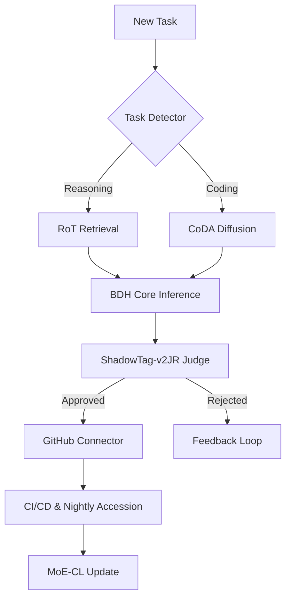

# ShadowTag-v2 Cognitive Stack v5 (The "Mega Roll-Up")
**Date**: 2025-10
**Status**: GOLD MASTER

## 1. Foundational Architectures
The "Brain" has evolved beyond simple Transformers.

### 1.1 BDH (Brain-Derived Hatchling)
*   **Concept**: Bridge brain-style sparse activations with Transformer performance.
*   **Key Shifts**:
    *   Linear Attention (vs Softmax).
    *   High-Dim (>10⁷) Sparse Activations.
    *   Info-Bounded Infinite Context.
*   **Role**: Inference Kernel for deep reasoning.

### 1.2 RoT (Retrieval-of-Thought)
*   **Concept**: Retrieve structured "Thought Graphs" instead of regenerating chains.
*   **Storage**: RedisGraph / pgvector.
*   **Mechanism**: Retrieve Node -> Reward Traversal -> Template -> Adapt.
*   **Metrics**: -40% Tokens, +82% Speed, -59% Cost.

### 1.3 MoE-CL (Continual Instruction Tuning)
*   **Concept**: Nightly training without forgetting.
*   **Structure**: Shared "General" Adapter + Task-Specific LoRA Adapters.
*   **Ops**: `agent:train:task` runs nightly.

### 1.4 Diffusion LMs (CoDA)
*   **Concept**: Parallel, bidirectional token generation.
*   **Role**: Bulk synthetic data & code generation (High Throughput).

## 2. The ShadowTag-v2JR Judge (Governance)
**"The 6th Arbitrator"**
It doesn't just vote; it enforces **Doctrine**.

*   **Purpose ("Why")**: Alignment with Safe/Profitable SaaS mission.
*   **Reasons ("How")**: Evidence-backed claims (citations required).
*   **Brakes ("What-If")**: Reversibility, Blast Radius, Army Risk Management.
*   **Output**: Executable Work Order (Spec -> Plan -> Tests).

## 3. Operations & Pipeline
*   **Runtime**: Micro-reasoners on AWS Lambda (Node 22 + Express).
*   **Cursor Task Pack**:
    *   `agent:use:grok-fast`
    *   `agent:bulk-sweep`
    *   `agent:validate`
*   **CI/CD Cognition**: Jules API + Gemini CLI.

## 4. Stack Integration

