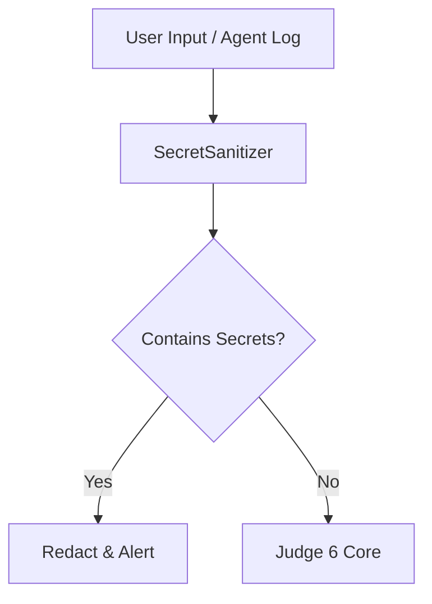

# JUDGE6: SECRET SANITIZER EXTENSION

> **CLASSIFICATION**: TIER 1 // SECURITY
> **STATUS**: DRAFT (Response to Google Security Advisory)

## 1. The Threat
"Long-lived credentials without proper security best practices remain a top security risk."
Agents often log full prompts or API requests. If these contain API Keys or PII, our logs become toxic.

## 2. The Solution: Layer 0 (The Sanitizer)
We implement a **PII & Secret Stripping Layer** that runs *before* any prompt is processed or logged.

### Architecture

### Techniques
1.  **Regex Scrubbing**: Detect common patterns (keys starting with `AIza`, `sk-`, email addresses, SSNs).
2.  **Google DLP API**: (Optional Enterprise) Use Cloud DLP to scan payloads.
3.  **Honeypot Values**: Detect if agents are trying to use known "canary" keys.

## 3. Implementation Plan

### `secret_sanitizer.py`
A new layer in `apps/src/api/domain/judge6/layers/` that provides:
1.  `scrub_text(text: str) -> str`: Returns sanitized text.
2.  `detect_leak(text: str) -> bool`: Returns True if high-confidence secret found.

### Integration in `guard.py`
The `GideonGuard.audit` decorator will call `SecretSanitizer.scrub_text` on all arguments before passing them to the function (or at least scrub the logs).

### Google Secret Manager
Ensure all agents leverage `google-cloud-secret-manager` instead of env vars where possible, adhering to the "Zero-Code Storage" rule.
