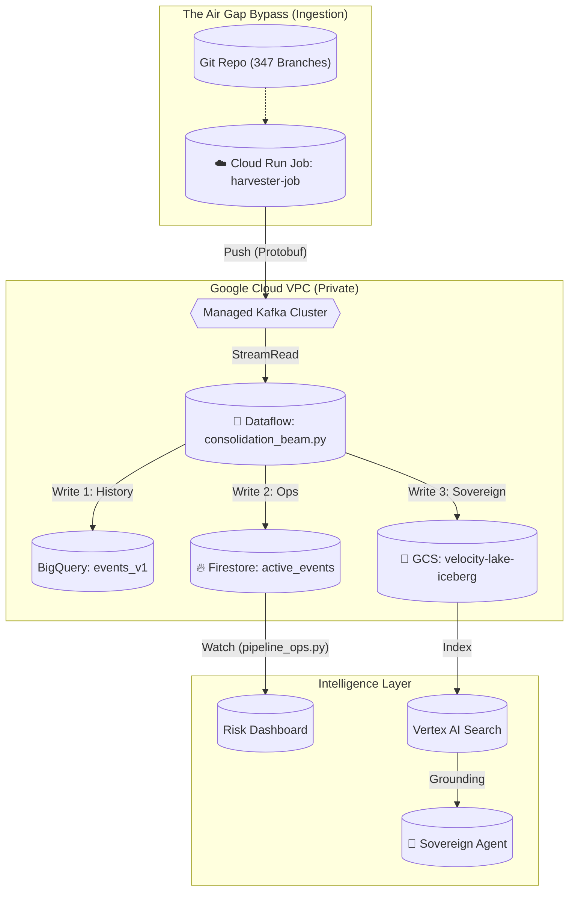

# 🗺️ AERIAL MAP: shadowtag-omega-v2

**Status:** 🟢 **DEPLOYED & ACTIVE**
**Version:** 2.0 (Sovereign)

> "The whole plan and tech stack visible."

## 🏗️ The Tech Stack (Sovereign Architecture)

| Layer | Component | Implementation | Sovereign Status |
| :--- | :--- | :--- | :--- |
| **Ingestion** | **The Nervous System** | **Cloud Run Job** + **Apache Kafka** | ✅ **Trojan Horse** |
| **Processing**| **The Hybrid Pipeline**| **Dataflow (Apache Beam)** | ✅ **Triple-Write** |
| **Logic** | **The Transformation** | **Dataform (SQL Mesh)** | ✅ **Strict ActAs** |
| **Storage** | **The Velocity Lake** | **BigQuery** (History) | ✅ **Sovereign** |
| **Storage** | **The Sovereign Lake** | **GCS / Apache Iceberg** | ✅ **Open Format** |
| **Ops** | **The Hot Cortex** | **Firestore Enterprise** | ✅ **Real-Time** |
| **Truth** | **The Grounding** | **Vertex AI Search** | ✅ **No Hallucination** |

---

## 🔗 The Architecture Diagram



---

## 📂 Key Artifacts (The Code)

### 1. The Infrastructure (Terraform)
*   **File:** [`infra/terraform/consolidation.tf`](file:///Users/pikeymickey/ShadowTag-v2-stack/ShadowTag-v2/infra/terraform/consolidation.tf)
*   **Role:** Defines the physical reality. Kafka Cluster, Buckets, Databases, IAM.

### 2. The Ingestion (Harvester)
*   **File:** [`scripts/harvest_docs_producer.py`](file:///Users/pikeymickey/ShadowTag-v2-stack/ShadowTag-v2/scripts/harvest_docs_producer.py)
*   **Role:** The "Trojan Horse". Runs inside the cloud, iterates git history, pushes to Kafka.

### 3. The Pipeline (Beam)
*   **File:** [`src/pipeline/consolidation_beam.py`](file:///Users/pikeymickey/ShadowTag-v2-stack/ShadowTag-v2/src/pipeline/consolidation_beam.py)
*   **Role:** The Logic. Processing raw events, routing to storage, calculating initial risk.

### 4. The Hot Cortex (Ops)
*   **File:** [`src/governance/judge_six/pipeline_ops.py`](file:///Users/pikeymickey/ShadowTag-v2-stack/ShadowTag-v2/src/governance/judge_six/pipeline_ops.py)
*   **Role:** Real-time Aggregation. "What is the total risk *now*?"

### 5. The Truth (Agent)
*   **File:** [`src/antigravity/grounded_agent.py`](file:///Users/pikeymickey/ShadowTag-v2-stack/ShadowTag-v2/src/antigravity/grounded_agent.py)
*   **Role:** The Output. An AI agent that answers questions using *only* the Deployment Data.

---

## 🚀 How to Operate

**1. Trigger Ingestion (Refresh Data)**
```bash
./scripts/deploy_harvester_cloud.sh
```

**2. Watch Real-Time Risk**
```bash
python3 src/governance/judge_six/pipeline_ops.py
```

**3. Ask the Sovereign Agent**
```bash
python3 src/antigravity/grounded_agent.py
```
