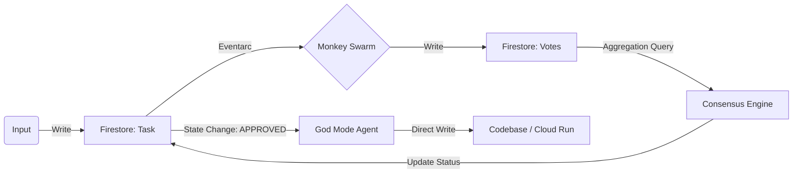

# God Mode via Firestore Pipelines
**Doctrine**: "The Database is the Flow."
**Reference**: [Google Cloud Blog: New Firestore Query Engine Enables Pipelines](https://cloud.google.com/blog/products/data-analytics/new-firestore-query-engine-enables-pipelines?e=48754805)

## The Theory
We do not orchestrate "God Mode" (Direct Writes) via a fragile script. We orchestrate it via a **Firestore Data Pipeline**.
The "New Query Engine" allows for efficient **Aggregation Queries** (COUNT, SUM, AVG) without client-side processing. This enables us to treat "Consensus" as a database query, not a complex code loop.

## The Pipeline Architecture

### Phase 1: The Trigger (User Intent)
**Action**: User/Antigravity creates a document in `tasks/{taskId}`.
*   `status`: "VOTING"
*   `payload`: "Refactor auth_service.py"

### Phase 2: The Fan-Out (Swarm Execution)
**Mechanism**: Firestore Trigger (`onCreate`) -> **Pub/Sub** -> **Cloud Run Workers**.
*   The "n-autoresearch/Kosmos/BioAgents" (Agents) wake up.
*   They analyze the task.
*   They write their Verdicts to `tasks/{taskId}/votes/{voteId}`.
    *   `verdict`: "PASS" | "FAIL"
    *   `confidence`: 0.98

### Phase 3: The "Query Engine" Reducer (The Magic)
**Mechanism**: Firestore Trigger (`onWrite` to `votes` subcollection).
**The "Thusly" Logic**:
Instead of loading all votes, we run a server-side **Aggregation Query**:
```sql
SELECT COUNT(*) FROM votes WHERE verdict = 'PASS'
```
*   **Condition**: If `PASS_COUNT >= 3` AND `JUDGE_6_APPROVAL == True`.
*   **Result**: The Pipeline State moves to `APPROVED`.

### Phase 4: God Mode Execution (The Write)
**Mechanism**: Firestore Trigger (`onUpdate` of `tasks/{taskId}` where `status` changes to `APPROVED`).
**The Action**:
1.  **God Mode Function** wakes up.
2.  **Pull**: Reads the final "Refined Code" from the winning vote.
3.  **Direct Write**: Commits to the GitHub Repo / Disk.
4.  **Verify**: Updates `tasks/{taskId}` to `COMPLETED`.

## Why This is "God Mode"
*   **Stateless**: The logic isn't in a running script that can crash. It's in the *data state*.
*   **Scalable**: You can have 10,000 n-autoresearch/Kosmos/BioAgents voting. The Firestore Query Engine aggregates them instantly ($0.00 cost for the query calculation logic basically).
*   **Auditable**: Every state change (Vote, Approval, Write) is an immutable document in Firestore, automatically piped to BigQuery (Iceberg) for the "Infinite Hindsight."

## Diagram

