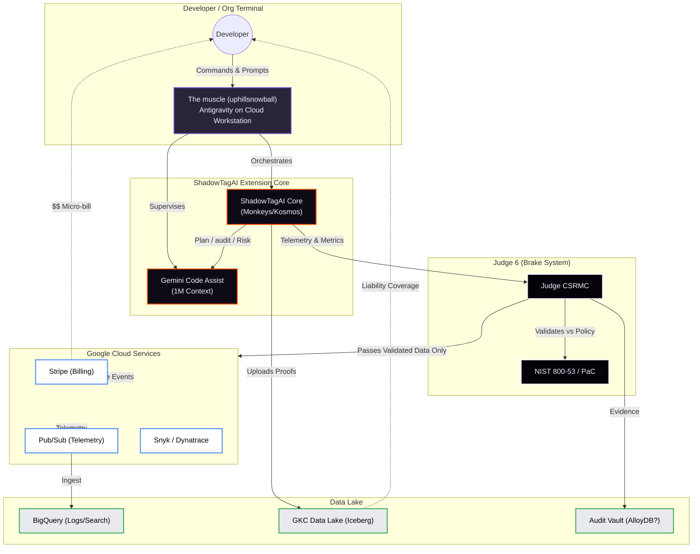

# ShadowTagAI: Economic + Control Flow Architecture
## "Juggernaut ↔ Brake" Model

This diagram represents the **ShadowTagAI** system running as a pure serverless Cloud Run architecture, orchestrated by Antigravity in "God Mode" (Uphill Snowball).

## Economic & Control Logic

### 🧠 Control Loop (Technical)
1. **Run 1 - Generator Chain**: Gemini Code Assist creates code/plan.
2. **Run 2 - Plan Mode**: Monkeys/Kosmos Reverse-engineers intent + risk.
3. **Run 3 - Validator Chain**: Judge/CSRMC executes audit, signs proof.
4. **Serverless Cloud Run**: Publishes outputs & billing artifact.

### ⚙️ Financial Flow
1. **Trigger**: User runs `shadowtagai risk eval` -> Stripe micro-bill ($0.05–$1/run).
2. **Audit**: Firestore invokes CSRMC validator -> Compliance Asset.
3. **Storage**: Proof uploaded to Iceberg Lake -> Liability coverage earned.
4. **Enterprise**: Licenses aggregate proofs -> $20–$3k/seat subscription.
