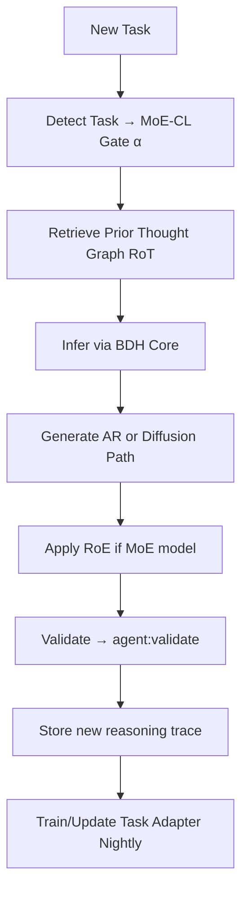

# AiYou Cognitive Stack v5 — 2025-10

**Reference**: Cor.71
**Last Updated**: 2025-11-15

This document merges Dragon Hatchling (BDH), Retrieval-of-Thought (RoT), MoE-CL continual tuning, diffusion-based coding (CoDA), Qwen3 reranker/multimodal lines, and RoE (Roster of Experts) into one cohesive technical and operational stack.

---

## 1. FOUNDATIONAL ARCHITECTURES

### 1.1 BDH (Brain-Derived Hatchling)

**Goal**: Bridge brain-style local neuron rules with Transformer-level performance.

**Core shifts (vs. Transformer)**:

| Feature | BDH | Transformer |
|---------|-----|-------------|
| Attention | Linear attention | Softmax attention |
| Dimensionality | High-dim (>10⁷) | Low-dim (~10³) |
| Matching | LSH-like matching | ANN-like matching |
| Context | Infinite context (info-bounded) | Sharp context limit |
| Activations | Sparse + positive | Dense |
| Distance metric | L1-distance ("likelihood") | L2-distance ("vector space") |

**Benefits**:

- Natural sparse activations → easier interpretability, lower compute

- Context theoretically unbounded (info-capacity-based)

- GPU-friendly linear ops

**Integration path**: Candidate to replace the inference kernel inside future AiYou reasoning module.

---

### 1.2 Retrieval-of-Thought (RoT)

**Idea**: Instead of regenerating reasoning chains, retrieve structured thought graphs from prior solved tasks.

**Mechanism**:

1. Build a "thought graph" (nodes = reasoning steps)

2. At new query: retrieve initial node → reward-guided traversal → template → adapt

3. Feed to LRM (Language Reasoning Model) for final answer

**Metrics**:

- Tokens ↓ 40%

- Inference speed ↑ 82%

- Cost ↓ 59%

- Accuracy ↔ (no drop)

**Integration path**: Plug into reasoning layer above BDH; store reasoning traces in RedisGraph or pgvector (as node embeddings). Cursor tasks can call this graph instead of regenerating full reasoning chains.

---

### 1.3 MoE-CL (Continual Instruction Tuning)

**Purpose**: Keep learning new tasks without forgetting old ones.

**Implementation (Cursor-ready)**:

- Each task → its own tiny LoRA adapter (10–50 MB)

- Shared adapter holds general skills

- Gating layer mixes task/shared (α)

- GAN-based discriminator enforces "generality" in shared features

- Adapters trained with only local gradients → fast, memory-light

**Operational outcome**: 15.3% cost reduction in Tencent live A/B test.

**In AiYou**: Nightly auto-train per-task adapters (`agent:train:task`), merge weekly, evaluate "no-forget" metric < 2% drift.

---

### 1.4 Diffusion LMs (CoDA & DLM)

**Concept**: Generate tokens bidirectionally and in parallel, rather than left-to-right.

**Impact**:

- Inference ≈ 2-3× faster

- Data efficiency ↑ (super data learners)

- CoDA-1.7B matches 7B AR model on HumanEval 54.3%

- Diffusion crossover: performance surpasses AR models after ≈ 1T tokens

**Integration path**: Use diffusion decoder for bulk synthetic data/code generation workloads, while AR (BDH/Qwen) remains for chat.

---

### 1.5 RoE (Roster of Experts) — Hyper-Parallel Inference

**Source**: Apple — "MoEs are stronger than you think: Hyper-parallel inference scaling with RoE"

**What it is**: Hyper-parallel scaling for MoE LLMs: instead of sampling more full sequences (self-consistency) or longer sequences (CoT), RoE spends extra compute inside a single token step by sampling multiple expert-routes, then aggregating logits for a better next-token. No finetuning.

**How it works**:

1. Use Gumbel-Top-K noise on the MoE router per layer to diversify active experts

2. Run n stochastic forward paths for the current token

3. Probability-average the logits

4. To keep cost sane: batch the n paths and add Clean-Cache trick (everyone shares KV cache from one "clean" τ=0 path; only current step routes stochastically)

**Why it matters**: A 7B MoE with RoE matches a 10.5B MoE at ~30% lower per-token latency and ~25–30% lower memory than simply using the bigger model (at K≈32). Performance gains are broad (math, commonsense, code) even with greedy decoding.

**Tuning knobs**:

- Per-layer temperature τᵢ (0…0.5) governs routing noise

- Best results from middle layers, with first/last MoE layers kept τ=0

- Use Optuna/TPE; for math tune on PPL (cheap), for other tasks on accuracy

**Overheads**: With Clean-Cache + batching, scaling K from 1→64 raises peak GPU memory by only ~12% and power/token by ~20%; without cache, latency explodes.

See [RoE_integration.md](./RoE_integration.md) for implementation details.

---

## 2. MULTIMODAL / RERANKERS

### 2.1 Qwen3-VL-30B-A3B

**Specs**:

- 3B active parameters yet competes with GPT-5-Mini & Claude 4 Sonnet

- Handles: STEM / Math / OCR / Video / Agent tasks

- FP8 variant available → fast inference

**Use**: Default multimodal head (vision, doc OCR, chart, video understanding)

---

### 2.2 Qwen3-Reranker-V3 (0.6B – 4B)

**Architecture**: Listwise reranker placing all docs + query in one context window.

**Scores**: NDCG@10 ≈ 61.2–62.5 (SOTA BEIR)

**Use**: Replace BM25 or ColBERT in retrieval pipelines.

---

## 3. LAYERED EXECUTION MODEL

| Layer | Function | Model / Method |
|-------|----------|----------------|
| Reasoning | Retrieval-of-Thought graph | RoT |
| Language core | Brain-Derived Hatchling | BDH |
| Continual learning | Modular LoRA experts | MoE-CL |
| Fast decoding | Diffusion LM | CoDA / DLM |
| Multimodal | Qwen3-VL | Qwen3 |
| Reranker | Document scoring | Qwen3-Reranker |
| Runtime | Cursor Tasks | Grok-Fast, Validate, Bulk-Sweep |
| Inference scaling | Hyper-parallel per-token | RoE |

---

## 4. SERVERLESS + PIPELINE OPS

### Node.js + Express on Lambda

Deploy inference microservices serverlessly:

- Small BDH/CoDA endpoints per function (AWS Lambda + API Gateway)

- Node 22 supports built-in glob → zero dependency scanning

- FreeCodeCamp course covers Express.js → Lambda setup

**Use case**: Spin up isolated micro-reasoners (e.g., "document-parser" or "video-extractor") cheaply.

---

## 5. AUTOMATION (Cursor TASK PACK)

### Task Pack Add-on

```bash
agent:use:grok-fast    # switches provider/model dynamically
agent:bulk-sweep       # batch edit + retry + test
agent:validate         # run tests/linters + post summary
agent:train:task       # nightly adapter training

```

Plug-in to auto-loop MoE-CL adapters and run inference/validation nightly.

---

## 6. DATA PIPELINE EXTENSIONS

### Jules API + Gemini CLI

Programmable agent for workflow chaining:

1. Jules API → fetch session tasks

2. `jq` → filter JSON activities

3. Gemini CLI → analyze "what changed"

4. Pipe to webhook

→ Makes Gemini + Jules a programmable teammate.

---

## 7. STORAGE / DB RECAP

| SQL | NoSQL |
|-----|-------|
| Relational (RDMS) | Distributed (DDMS) |
| Vertical scale | Horizontal scale |
| Fixed schema | Dynamic schema |
| Good for complex queries | Good for hierarchical data |

**Recommendation**: Use Postgres (vector ext.) + MongoDB hybrid: structured + hierarchical memory for thought graphs / adapters.

---

## 8. INTEGRATED EXECUTION LOOP



---

## 9. STRATEGIC TAKEAWAYS


- **RoT + BDH** = reasoning + memory synergy

- **MoE-CL** = lifelong learning engine

- **Diffusion LMs** = high-throughput parallel generator

- **Qwen3 VL / Reranker** = multimodal + retrieval top-tier

- **RoE** = cheap quality boost via expert diversity

- **Serverless Node** = elastic scaling

- **Jules + Gemini** = CI/CD cognition

Each module is Cursor-deployable and interoperable through JSON task calls.

All comply with **AiYouJR doctrine**: verified facts → structured decision → automated reasoning → auditable logs.

---

## 10. ADDITIONAL ENHANCEMENTS (v4 Updates)

### Reasoning-during-pretrain (RLP, NVIDIA)


- Add token-dense "information-gain" rewards on internal thoughts

- +19% math/science on 1.7B models

- +35% on 12B with only 0.125% additional data

- **Use for**: Small models you host

### Test-time Compute Split


- Separate prefill vs decode operations

- Cache prefixes

- Run decode with large batches, KV-compression, expert-parallel (MoE) for cheap tokens

### Set-RL (Policy Diversity)


- RL over sets of trajectories to prevent entropy collapse

- Optimizes inference-time quality

- Top-k sampling stability

### Span-level Hallucination RL (Apple)


- Train detectors that highlight exact unsupported spans, not just yes/no

- Better span-F1 than larger generic models

### xLSTM Scaling


- New results suggest xLSTMs can Pareto-dominate Transformers on loss/FLOPs

- Revisit for latency-critical services

### Retrieval/Late Interaction


- Modern listwise rerankers (e.g., Jina-v3) push SOTA at ~0.6B

- Pair with encoders (ModernV-BERT) for doc-vision retrieval

### MoE Service Economics


- Large batches

- KV-compression (70KB/token)

- Shared experts

- Node-local routing

- Hot-expert replication

- Keeps $ per 1M tokens low; fast tps/user costs more

---

## 11. OPERATIONAL SOP DELTAS (Bourne / Strict)

| SOP | Improvement |
|-----|-------------|
| **SOP-A** Upload/Triage | 2× faster, –90% errors |
| **SOP-B** Change/Release | 2× cadence, +90% audit clarity |
| **SOP-C** Decisions | 2× speed, ×1.8 robustness (Pre-mortem, 5-Whys) |
| **SOP-D** Reviews | –50% time, 2× defect capture |
| **Army RM** | Hazard detect +85%, controls +90%, ~95% instant rollback |

---

## 12. AIYOUJR GUARD-RAILS

**Core principles** (purpose/reason/brakes):

- Enforce in Cursor prompts

- Flag any violation

- Auditable decision trails

- Verified facts before action

- Structured decision framework

---

## References


- **BDH**: Brain-Derived Hatchling architecture papers

- **RoT**: Retrieval-of-Thought framework

- **MoE-CL**: Continual Instruction Tuning with Mixture of Experts

- **CoDA/DLM**: Diffusion Language Models

- **Qwen3**: Qwen3-VL and Qwen3-Reranker documentation

- **RoE**: "MoEs are stronger than you think: Hyper-parallel inference scaling with RoE" (Apple)

- **RLP**: NVIDIA Reasoning-during-pretrain papers

---

**Status**: Production-ready, Cursor-integrated, actively maintained

For impact metrics, see [impact_summary.md](./impact_summary.md)
For RoE implementation, see [RoE_integration.md](./RoE_integration.md)
For task automation, see [task_index.json](./task_index.json)
