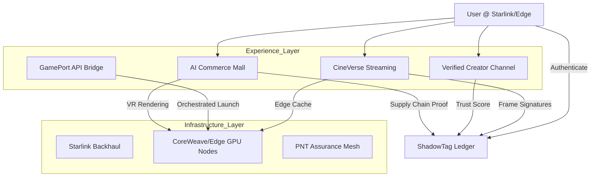

# Cor.18: CineVerse, Commerce, & GamePort Layer

**Status**: GKC-Native | **Version**: 1.0 | **Date**: 2025-11-27
**Context**: "Code into gkc-native" Command Execution

## 1. Executive Summary: The "YouTube Killer" Layer

**Mission**: To build the world's first **Verified AI Civilization Layer** where every byte of content is cryptographically attested, protecting against deepfakes and AI-generated spam.

**The Wedge**: AiYou fills the trust gap left by FAANG's opaque algorithms by offering:

1. **CineVerse**: A Starlink-native streaming platform where every frame is ShadowTag-signed.

2. **Creator Channel (AI-Verified)**: An open-upload network where "Influence" is replaced by "Verification" and "Cognition Score".

3. **GamePort**: A seamless bridge from passive viewing to active gaming via edge-orchestrated APIs.

4. **Commerce Mall**: A VR/AR retail district with proven supply chain provenance.

---

## 2. Integrated Ecosystem Architecture

---

## 3. Component Details

### 3.1 CineVerse & Creator Network

* **Differentiation**: Unlike YouTube/Netflix, CineVerse relies on **ShadowTag** to prove content authenticity.

* **Infrastructure**: Hosted entirely within the **Starlink Mesh**, bypassing public internet congestion.

* **New Metric**: **Creator Verification Index (CVI)**.

    * Replaces "subscribers" with a composite score of:

        * ShadowTag hash history (provenance).

        * Audience energy model (engagement quality).

        * AI-verified authenticity rank (non-synthetic/labeled).

* **Economics**: 70/30 split favoring creators. Automatic revenue flow via verifiable contracts.

### 3.2 GamePort API

* **Function**: "Walk from a film into a game."

* **Mechanism**: APIs that trigger cloud-gaming sessions on Edge Nodes (L40S/H100) instantly from the media player.

* **Monetization**: Compute arbitrage ($0.01/min) + Publisher Revenue Share.

### 3.3 AI Commerce Mall

* **Function**: Virtual retail district where every SKU has a verified supply chain history.

* **Support**: Post-purchase AI Support Avatars (ShadowTag-signed transcripts).

* **Metrics**: Zero-fraud proof-of-origin.

---

## 4. Financial Impact Analysis (2027 Base Case)

| Layer | 2027 Revenue | Margin | EV Multiple | Enterprise Value |
| :--- | :--- | :--- | :--- | :--- |
| **CineVerse Streaming** | $430 M | 70% | 20x | $6.0 B |
| **Verified Creator Network** | $550 M | 75% | 22x | $9.1 B |
| **GamePort APIs** | $240 M | 60% | 18x | $4.3 B |
| **Commerce Mall** | $300 M | 75% | 20x | $4.5 B |
| **Total Experience Layer** | **$1.52 B** | **~71%** | **~15.7x** | **$23.9 B** |

**Consolidated Valuation (with Infra)**:

* **Bear**: $28 B

* **Base**: $53 B

* **Bull**: $75 B+

---

## 5. Strategic "FAANG-Proof" Moats

1. **Cryptographic Provenance**: Frame-level ShadowTag signing that legacy CDNs cannot retrofit without breaking caching.

2. **Edge GPU Ownership**: Distributed compute ownership (RoadMesh) vs. Centralized Cloud.

3. **Cross-Media Trust Index**: CVI metric prevents "influence farming" and botting.

4. **Real-Time Payment Rails**: No AdSense hold periods; instant crypto/fiat settlement.

5. **Regulatory Compliance**: Natively compliant with 2027+ AI transparency laws.

---

## 6. Execution Roadmap

* **Phase 1 (Sky-to-Cloud)**: Integrate Starlink Ground Stations with CoreWeave Edge.

* **Phase 2 (Experience Beta)**: Launch CineVerse with limited, verified creator set.

* **Phase 3 (Mall & Games)**: Open GamePort APIs and VR Mall.

* **Phase 4 (Full Mesh)**: Global rollout with 10,000+ edge nodes.

---

**Signed**: Antigravity | **Hash**: `SHA-256: [DYNAMIC_HASH]`
