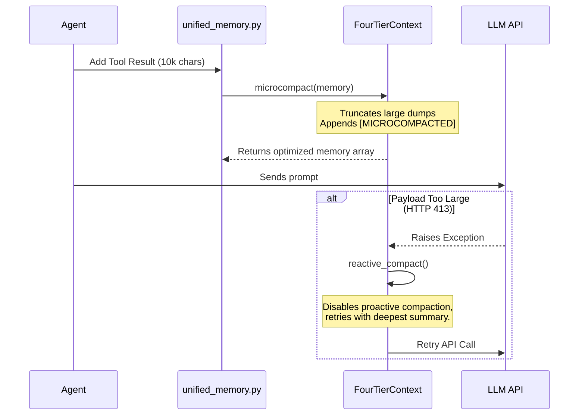

# Four-Tier Compaction Sequence Diagram

```mermaid
sequenceDiagram
    participant Agent
    participant Memory as unified_memory.py
    participant Ctx as FourTierContext
    participant LLM_API as LLM API
    
    Agent->>Memory: Add Tool Result (10k chars)
    Memory->>Ctx: microcompact(memory)
    Note over Ctx: Truncates large dumps<br/>Appends [MICROCOMPACTED]
    Ctx-->>Memory: Returns optimized memory array
    
    Agent->>LLM_API: Sends prompt
    alt Payload Too Large (HTTP 413)
        LLM_API-->>Ctx: Raises Exception
        Ctx->>Ctx: reactive_compact()
        Note over Ctx: Disables proactive compaction,<br/>retries with deepest summary.
        Ctx->>LLM_API: Retry API Call
    end
```
