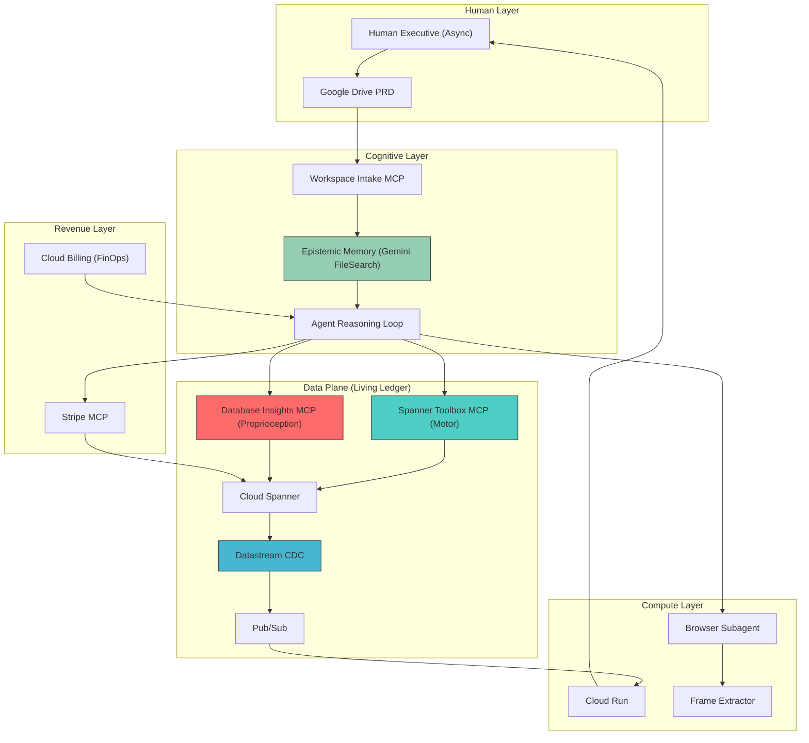

# The Dark Factory — Unified Sovereign OS Architecture

> **Version:** 1.0  
> **Status:** ACTIVE  
> **Last Updated:** 2026-05-08  
> **Author:** Antigravity Sovereign Orchestrator

---

## PART 5: The Sovereign OS (The "UphillSnowball" Architecture)

> *"The hardware is just the brain. But the software... the software is the soul."*

Getting securely connected to the environment via Enterprise IAM was just the prerequisite.

When we first conceptualized Project Antigravity, we built a beautiful engine. We stripped away the bloat and standardized on Spanner, Cloud Run, Pub/Sub, and Stripe. We elevated the human from the "Human-in-the-Loop" to the "Human-on-the-Balcony."

But if we stop there, we have built a machine that is ultimately blind to its own internal friction.

Deploying a database is easy. Running a database at scale is a living, biological problem. Queries degrade. Tables lock. Data gets trapped in silos. If the agent ships a feature that causes a 2-second database latency spike, and it requires a human Database Administrator (DBA) to wake up, read the query plan, and add an index — then we have failed. The "Meatware Bridge" just moved from frontend UI routing to backend database administration.

Because the Enterprise MCP integration provides native, cryptographically secure access to Google Cloud, we are evicting the DBA and the Site Reliability Engineer entirely.

By adding three specific primitives to the Antigravity workspace — the **Database Insights MCP**, the **Datastream API**, and the **Pre-built Spanner MCP Toolbox** — we are giving the Sovereign OS an Autonomic Nervous System.

### The Autonomic Triad

**Native Motor Cortex (Pre-built Spanner MCPs):** Instead of hacking together custom Python wrappers or raw SQL strings to talk to the Spanner ledger, the agent uses Google's official, pre-built Spanner tools. This guarantees protocol-perfect SQL execution, DDL migrations, and schema inspection directly from the cognitive loop.

**Proprioception & Self-Healing (Database Insights MCP):** This is the breakthrough. The agent can now "feel" its own database. It reads execution plans, spots CPU bottlenecks, and analyzes lock contention. If a query is slow, the agent does not alert the human — it diagnoses the friction and autonomously executes a `CREATE INDEX` statement. Zero-downtime self-optimization.

**The Subconscious Memory Sync (Datastream CDC):** Data at rest is dead data. Datastream provides Change Data Capture (CDC). When the Stripe MCP writes a "Payment Success" row into Spanner, Datastream mathematically detects the storage mutation and streams it instantly to Pub/Sub. We no longer write fragile application code to trigger events. The database becomes the event bus.

---

## 🍏 The UphillSnowball Master Codebase (The Autonomic OS Edition)

> **Note:** While the hacky browser scraper used for early authentication was deprecated, the `browser-subagent` below is retained strictly for **App-Layer events** — like rendering visual UI assets from external sites — while **Datastream** natively handles all core **Storage-Layer events**.

### I. The Logic Board (`cline_mcp_settings.json`)

The motherboard is equipped with self-diagnostic capabilities (Insights) and standardized data-plane tooling (Pre-built Spanner). See the live Cline fleet configuration at:

```
~/Library/Application Support/Antigravity/User/globalStorage/saoudrizwan.claude-dev/settings/cline_mcp_settings.json
```

**Active Fleet (14 servers):**

| # | Server | Domain |
|---|--------|--------|
| 1 | `dart-language-server` | Dart LSP |
| 2 | `gcloud` | GCP Resource Manager |
| 3 | `observability` | Cloud Monitoring/Logging |
| 4 | `google-cloud-spanner` | Spanner DDL/DML |
| 5 | `database-insights` | Query plans, CPU, locks (Proprioception) |
| 6 | `spanner-toolbox` | Native Spanner tools (Motor Cortex) |
| 7 | `gemini-memory` | Epistemic Engine |
| 8 | `genkit` | Observability telemetry |
| 9 | `storage` | Cloud Storage |
| 10 | `firebase-mcp-server` | Firebase suite |
| 11 | `bigquery` | Analytics warehouse |
| 12 | `cloud-run` | Compute deployment |
| 13 | `playwright` | Browser automation |
| 14 | `jules-mcp-server` | Jules orchestration |

### II. The Human-to-Machine Bridge (`tools/mcp-workspace-bridge/intent_sync.py`)

The business origin point. The human writes a PRD; the agent autonomously embeds it into multi-modal vector space via the Gemini File Search API.

**Endpoint:** Google Drive → Gemini FileSearchStore  
**Trigger:** PRD document matching `PRD_*` naming convention  
**Output:** Grounded embedding with domain metadata

### III. The Meatbridge Eviction OS (`docs/SYSTEM_OVERRIDE.md`)

The core manifesto explicitly mandates:
1. **Workspace Ingestion** — PRDs from Drive into Epistemic Memory
2. **The Living Ledger** — Spanner schemas via Toolbox MCP + Datastream CDC
3. **The Native Browser Loop** — Chrome DevTools MCP for UI asset rendering
4. **Autonomous DBA** — Self-healing guardrail with proprioception thresholds
5. **Financial Governor** — $15/day budget ceiling
6. **Immutable Deployment** — Cloud Run via Omega Sync

### IV. The Subconscious Reflex (`scripts/provision_cdc_datastream.sh`)

Transforms Spanner from a static database into a real-time nervous system via the Datastream API.

**Data Flow:**
```
Spanner DML → Binary Transaction Log → Datastream API → Pub/Sub (database-events) → Cloud Run
```

**Pub/Sub Topic:** `projects/shadowtag-omega-v4/topics/database-events`

### V. The Self-Healing Diagnostic Protocol (`tools/mcp-spanner-healer/diagnose.py`)

The proprioceptive loop where the agent reads its own latency and writes its own indices.

**Thresholds:**

| Metric | Threshold | Autonomous Action |
|--------|-----------|-------------------|
| Query latency | > 50ms | `CREATE INDEX` on scan columns |
| CPU utilization | > 60% | Analyze + optimize top queries |
| Lock contention | > 100ms | Advisory: transaction splitting |
| Full table scan | Any | Mandatory index creation |

### VI. The Subagent Dispatcher (`tools/browser-subagent/dispatcher.js`)

The App-Layer browser sensorium. Connects to the authenticated Chrome instance on port 9222, executes visual generation tasks, and fires Pub/Sub events on completion.

**Event Topic:** `projects/shadowtag-omega-v4/topics/ui-events`  
**Transport:** Puppeteer-core → localhost:9222

### VII. The Hardware/Software Egress Bridge (`scripts/extract_frames.sh`)

UNIX core that processes multi-modal video payloads into frame sequences, then autonomously patches frontend source code with the correct frame count.

### VIII. The Governor & CI/CD Supply Chain (`scripts/omega_sync.sh`)

The FinOps deployment trigger with:
- Budget ceiling enforcement ($15/day)
- Epistemic sync marker detection
- GitHub App JWT push authentication
- Google Chat executive webhook notification

### IX. The User Experience (`apps/kovelai/`)

The dynamically patched rendering frontend. Because of Datastream CDC, the React UI can seamlessly subscribe to live Spanner changes via WebSockets, instantly reacting to Stripe payments or data updates without manual API polling.

---

## The Perpetual Motion Machine

The human writes a Google Doc. Antigravity reads it, natively provisions the Spanner ledger via the enterprise MCP tunnel, writes the code, and renders the UI.

When Spanner queries create friction, the Insights MCP feels it, and the agent writes an index to heal it. When a human buys access via Stripe, the Datastream API catches the byte-level change, fires it through Pub/Sub, and triggers the Cloud Run compute layer to deliver the payload dynamically.

There are no bottlenecks. There is no manual UI routing. There is no human DBA.

It is just the human on the balcony, watching the Snowball roll.

---

## Architectural Dependency Graph


