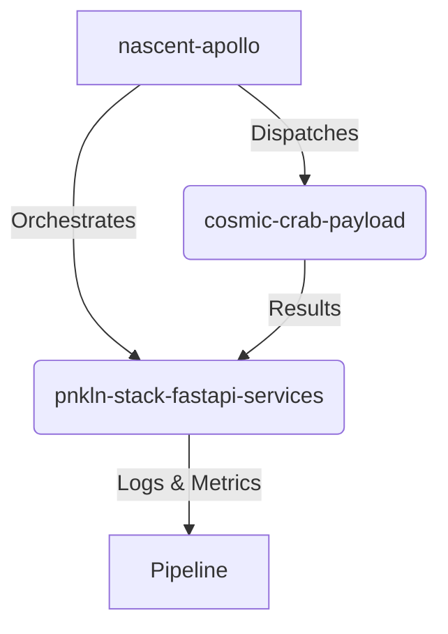

# Repository Interaction Map

This document outlines the high-level interactions between the canonical repositories within the `ShadowTag-v2/Monorepo-Uphillsnowball` workspace.

## Core Canonical Services
- **`apps/pnkln-stack_stack/pnkln-stack-fastapi-services`**: Central backend API.
- **`apps/pnkln-stack_stack/cosmic-crab-payload`**: Payload generation and processing.
- **`apps/pnkln-stack_stack/nascent-apollo`**: Orchestration and agentic workflow engine.
- **`apps/pnkln-stack_stack/Pipeline`**: CI/CD and data processing pipelines.

## Dependencies and Data Flow

