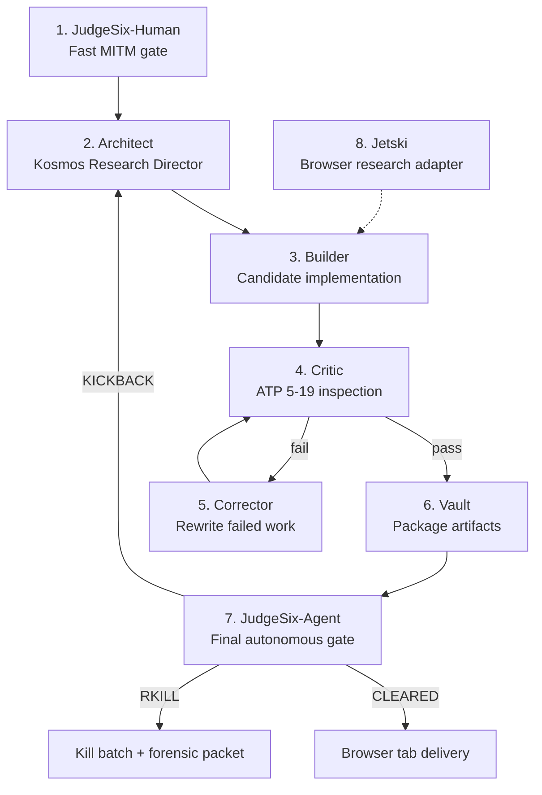

# UphillSnowball Architecture

**Version**: 2.0
**Last Updated**: 2026-04-24
**Status**: Canonical

> **UphillSnowball uses Cor.autoresearch as its engine: Kosmos directs, BioAgents routes,
> n-autoresearch executes, iii tracks state, JudgeSix-Human gates human/server actions,
> JudgeSix-Agent gates every agent output, the whiteboard persists unresolved issues,
> and RKILL terminates unsafe or non-convergent runs.**

## Naming Convention

| Context | Value |
|---|---|
| Human/display name | Cor.autoresearch |
| Python package | `cor_autoresearch` |
| Primary class | `AutoresearchEngine` |
| Service name | `uphillsnowball-engine` |
| Cloud Run name | `uphillsnowball-engine` |
| Docker image | `uphillsnowball/engine` |
| GitHub workflow | `deploy-uphillsnowball-engine.yml` |
| API prefix | `/v1/autoresearch` |

## Two-Sidecar Cloud Run Layout

```
Browser tab
  ↓
Cloud Run Control Sidecar (uphillsnowball-control)
  - JudgeSix-Human
  - Run registry
  - Browser event stream
  - Approval / lock / RKILL controls

Cloud Run Engine Sidecar (uphillsnowball-engine)
  - Cor.autoresearch (AutoresearchEngine)
  - Kosmos direction layer (KosmosBridge)
  - BioAgents routing layer (BioAgentsWorker)
  - n-autoresearch / iii execution layer (NAutoresearchClient)
  - JudgeSix-Agent
  - Whiteboard
  - RuntimeWatchdog
  - Artifacts (Vault)
```

### Service 1: `uphillsnowball-control`

```yaml
apiVersion: serving.knative.dev/v1
kind: Service
metadata:
  name: uphillsnowball-control
spec:
  template:
    spec:
      containers:
        - name: control
          image: us-central1-docker.pkg.dev/PROJECT/uphillsnowball/control:latest
          ports:
            - containerPort: 8080
          env:
            - name: ENGINE_BASE_URL
              value: "https://uphillsnowball-engine-xxxxx.run.app"
```

### Service 2: `uphillsnowball-engine`

```yaml
apiVersion: serving.knative.dev/v1
kind: Service
metadata:
  name: uphillsnowball-engine
spec:
  template:
    spec:
      containers:
        - name: engine
          image: us-central1-docker.pkg.dev/PROJECT/uphillsnowball/engine:latest
          ports:
            - containerPort: 8080
          env:
            - name: N_AUTORESEARCH_BASE
              value: "http://127.0.0.1:3111"

        - name: n-autoresearch-orchestrator
          image: us-central1-docker.pkg.dev/PROJECT/uphillsnowball/n-autoresearch:latest
          env:
            - name: PORT
              value: "3111"
```

**Note**: For production GPU work, dispatch heavy bounded training to Cloud Run Jobs
(up to 168h timeout) or external GPU worker pools. The service sidecar handles
orchestration; bounded GPU experiments run as jobs.

## Eight-Agent Topology



| # | Agent | Role |
|---|-------|------|
| 1 | JudgeSix-Human | Fast MITM gate for human/server actions |
| 2 | Architect | Kosmos Research Director — hypothesis and plan |
| 3 | Builder | Produces candidate implementation / experiment patch |
| 4 | Critic | ATP 5-19 / 17-layer inspection |
| 5 | Corrector | Rewrites failed work after Judge/Critic rejection |
| 6 | Vault | Packages cleared artifacts, hashes, provenance, citations |
| 7 | JudgeSix-Agent | Final autonomous gate before delivery |
| 8 | Jetski | Authorized browser/search/data-collection sidecar |

## Cor.autoresearch Loop

```
Human/server event
  ↓
JudgeSix-Human
  ├─ Level 0–2: pass / warn
  ├─ Level 3: show three COAs
  ├─ Level 4: dispatch Cor.autoresearch
  └─ Level 5: hard lock, forensic packet, management alert

Cor.autoresearch loop
  ↓
Architect / Kosmos
  ↓
BioAgents route + queue
  ↓
n-autoresearch / iii experiment execution
  ↓
Critic
  ↓
Corrector if needed
  ↓
Vault
  ↓
JudgeSix-Agent
  ├─ CLEARED: deliver to browser tab
  ├─ KICKBACK: return to Architect with guidance
  └─ RKILL: kill batch, freeze whiteboard, forensic packet
```

The whiteboard remains active from the first JudgeSix-Agent rejection until CLEARED
or RKILLED, preserving kickback count, capabilities state, output summaries, and
judge verdicts.

## API Endpoints

### Autoresearch Runs

```
POST /v1/autoresearch/runs               — Create a new research run
GET  /v1/autoresearch/runs/:run_id        — Get run status
GET  /v1/autoresearch/runs/:run_id/events — SSE event stream
POST /v1/autoresearch/runs/:run_id/cancel — Cancel a run
POST /v1/autoresearch/runs/:run_id/rkill  — Emergency RKILL
```

### Judge Gates

```
POST /v1/judge/human/evaluate  — JudgeSix-Human evaluation
POST /v1/judge/agent/evaluate  — JudgeSix-Agent evaluation
```

### Experiments (n-autoresearch)

```
POST /v1/experiments/setup     — Set up experiment
POST /v1/experiments/register  — Register with GPU orchestrator
POST /v1/experiments/complete  — Report completion + val_bpb
POST /v1/search/suggest        — Get search strategy suggestions
POST /v1/reports/summary       — Generate summary report
```

### Health

```
GET  /health  — Service health check
GET  /stats   — Service statistics
```

## File Layout

```
labs/uphillsnowball/
├── engine/
│   ├── __init__.py
│   ├── cor_autoresearch.py       # AutoresearchEngine (main orchestrator)
│   ├── kosmos_bridge.py          # Kosmos Research Director bridge
│   ├── bioagents_worker.py       # BioAgents routing layer
│   └── n_autoresearch_client.py  # n-autoresearch execution client
├── governance/
│   ├── __init__.py
│   ├── judge_six_human.py        # JudgeSix-Human gate
│   ├── judge_six_agent.py        # JudgeSix-Agent gate
│   ├── runtime_watchdog.py       # Runtime monitoring (ENDEX/RKILL)
│   └── rkill.py                  # RKILL emergency stop handler
└── ...
```

## What Was Replaced

| Legacy Concept | Removed | Replacement |
|---|---|---|
| `FlyingMonkeys` class | ✅ | `AutoresearchEngine` |
| `flying_monkeys.py` | ✅ | `cor_autoresearch.py` |
| `flyingmonkeys-server` | ✅ | `uphillsnowball-engine` |
| `deploy-flyingmonkeys.yml` | ✅ | `deploy-uphillsnowball-engine.yml` |
| 600-agent swarm | ✅ | Kosmos + BioAgents + n-autoresearch triad |
| monkey dashboard | ✅ | research run console |
| monkey watchdog | ✅ | `runtime_watchdog` |
| Tauri desktop app | ✅ | browser tab + WebAuthn |
| local biometric hooks | ✅ | WebAuthn / FIDO2 passkeys |

## UI

Browser tab + WebAuthn approvals + Cloud Run control plane.

No Tauri. No local desktop wrapper. No local biometric daemon.
WebAuthn replaces TouchID/FaceID hooks via the Web Authentication API.

## Cloud Run Considerations

- **Services**: Interactive research runs in Cloud Run services (sidecar pattern)
- **Jobs**: Bounded GPU experiments as Cloud Run Jobs (up to 168h timeout, GPU capped at 1h)
- **Workers**: Heavy GPU training dispatched to external GPU worker pools
- **Sidecar communication**: Via `localhost` within the same instance
