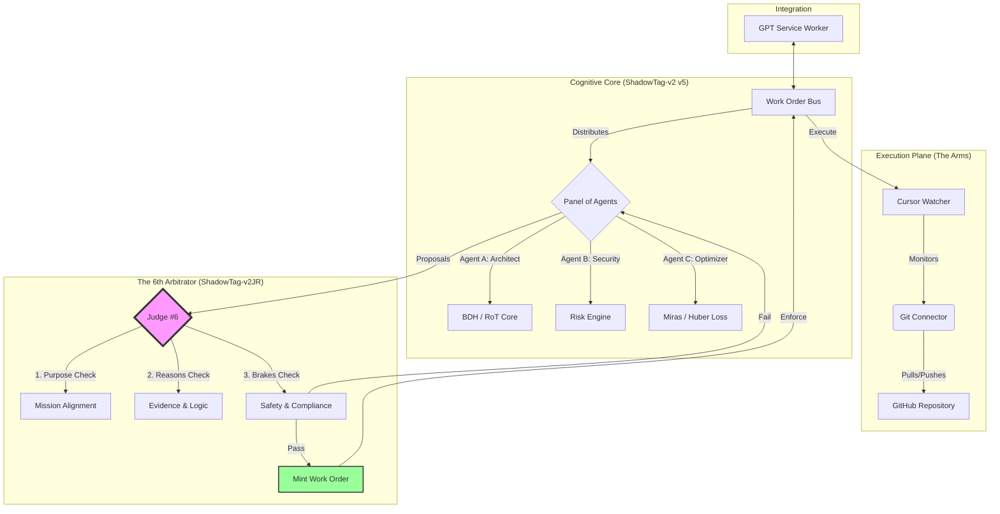

```mermaid
graph TD
    subgraph "Execution Plane (The Arms)"
        A[Cursor Watcher] -->|Monitors| B(Git Connector)
        B -->|Pulls/Pushes| C[GitHub Repository]
    end

    subgraph "Cognitive Core (ShadowTag-v2 v5)"
        D[Work Order Bus] -->|Distributes| E{Panel of Agents}
        E -->|Agent A: Architect| F[BDH / RoT Core]
        E -->|Agent B: Security| G[Risk Engine]
        E -->|Agent C: Optimizer| H[Miras / Huber Loss]
    end

    subgraph "The 6th Arbitrator (ShadowTag-v2JR)"
        E -->|Proposals| I{Judge #6}
        I -->|1. Purpose Check| J[Mission Alignment]
        I -->|2. Reasons Check| K[Evidence & Logic]
        I -->|3. Brakes Check| L[Safety & Compliance]

        L -->|Pass| M[Mint Work Order]
        L -->|Fail| E
        M -->|Enforce| D
    end

    subgraph "Integration"
        ServiceWorker[GPT Service Worker] <--> D
        D -->|Execute| A
    end

    style I fill:#f9f,stroke:#333,stroke-width:4px
    style M fill:#9f9,stroke:#333,stroke-width:2px
```
