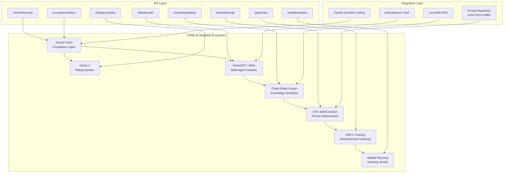
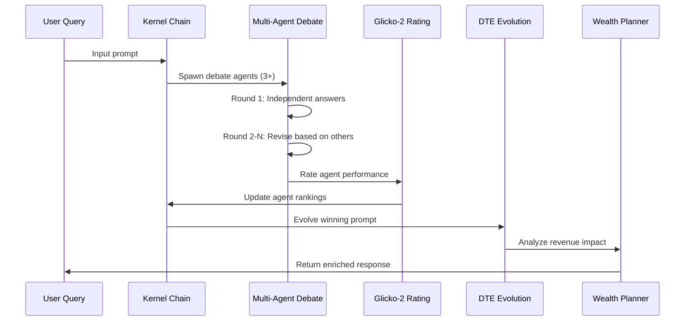

# PINKLN Ultrathink Architecture

## System Overview

## Data Flow

## Component Details

| Component | LOC | Purpose | Key Innovation |
|-----------|-----|---------|----------------|
| Kernel Chain | ~200 | Decision pipeline foundation | Gemini function calling |
| Glicko-2 | ~150 | Dynamic agent rating | Bayesian skill tracking |
| PanelGPT/MAD | ~300 | Multi-agent debates | Factuality via adversarial dialog |
| Cheat Sheet Fusion | ~100 | Knowledge synthesis | Cross-component memory |
| DTE Self-Evolution | ~200 | Prompt optimization | Autonomous improvement loop |
| GRPO Training | ~150 | Reinforcement learning | Mean-centered advantage (no clipping) |
| Wealth Planning | ~250 | Revenue analysis | Leak detection + funnel redesign |
