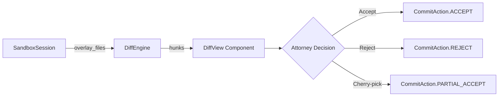

# Attorney Diff-View Component Specification

> **Status**: DRAFT | **Phase**: 3 | **Milestone**: 3 of 7

## Purpose

Renders AI-generated document edits in a side-by-side diff view for attorney
review within the CounselConduit sandbox. This is the decision-making surface
where attorneys accept, reject, or cherry-pick speculative document changes
before they commit to production Firestore.

## Architecture



## Component Interface

```typescript
interface DiffViewProps {
  /** Session ID from SandboxSession */
  sessionId: string;
  /** Matter ID for privilege tracking */
  matterId: string;
  /** Map of file paths to their diff hunks */
  diffs: DiffFile[];
  /** Callback when attorney makes a decision */
  onDecision: (action: CommitAction, selectedFiles?: string[]) => void;
  /** Loading state while overlay computes */
  isLoading?: boolean;
}

interface DiffFile {
  path: string;
  language: string;
  hunks: DiffHunk[];
  privilegeStatus: 'privileged' | 'work_product' | 'public';
  aiConfidence: number; // 0-1 score from speculation engine
}

interface DiffHunk {
  oldStart: number;
  oldLines: number;
  newStart: number;
  newLines: number;
  changes: DiffChange[];
}

interface DiffChange {
  type: 'add' | 'delete' | 'context';
  content: string;
  lineNumber: number;
}

type CommitAction = 'accept' | 'reject' | 'partial_accept';
```

## Visual Design

### Layout
- **Split-pane**: Original (left) vs. AI suggestion (right)
- **Unified toggle**: Single-pane unified diff for mobile/narrow viewports
- **File navigator**: Sidebar with file tree, checkboxes for cherry-pick selection
- **Confidence indicator**: Per-hunk confidence badge (green/yellow/red)

### Design Tokens (from KovelAI globals.css)
| Token | Value | Usage |
|-------|-------|-------|
| `--color-surface-bg` | `#09090b` | Diff background |
| `--color-surface-elevated` | `#18181b` | File header background |
| `--color-border-subtle` | `#27272a` | Hunk separators |
| `--color-brand-gold` | `#c5a059` | AI confidence highlights |
| `--color-text-primary` | `#fafafa` | Diff content text |
| `--color-text-muted` | `#a1a1aa` | Line numbers, metadata |

### Diff Colors
| State | Background | Text |
|-------|-----------|------|
| Addition | `#0d2818` (dark green) | `#4ade80` |
| Deletion | `#2d0a0a` (dark red) | `#f87171` |
| Context | transparent | `--color-text-muted` |
| Selected (cherry-pick) | `#c5a05920` (brand-gold/12%) | `--color-text-primary` |

### Animations
- **Hunk highlight**: 200ms ease-in-out background fade on hover
- **File expand**: 300ms slide-down with content fade-in
- **Accept/Reject button**: 150ms scale transform + ripple effect
- **Confidence badge**: Subtle 2s pulse animation for low-confidence hunks

## Interaction Patterns

1. **Review Mode**: Attorney scrolls through diffs, hover highlights hunks
2. **Cherry-pick Mode**: Toggle checkboxes on individual files/hunks
3. **Decision**: Click Accept All / Reject All / Accept Selected
4. **Confirmation**: Modal with summary of changes and privilege warnings
5. **Telemetry**: Each interaction logged for suggestion quality tuning

## Security Constraints

- **Privilege badges**: Privileged content gets visible `🔒` badge
- **No copy/paste**: Right-click disabled on privileged content
- **Attorney verification**: Component checks `attorney_uid` before rendering
- **Audit logging**: Every file view, hover, and decision action logged

## Accessibility

- WCAG 2.1 AA compliant color contrast
- Keyboard navigation: Tab through files, Space to toggle cherry-pick
- Screen reader: ARIA labels for diff states (`aria-label="Added line 42"`)
- Reduced motion: Respects `prefers-reduced-motion` media query

## Dependencies

- `diff` (npm): Compute text diffs between original and overlay
- `react-syntax-highlighter` or `shiki`: Language-aware syntax coloring
- `@radix-ui/react-checkbox`: Accessible cherry-pick checkboxes
- `framer-motion`: Micro-animations for hunk transitions

## File Structure

```
src/components/diff-view/
├── DiffView.tsx           # Main container
├── DiffFile.tsx           # Single file diff renderer
├── DiffHunk.tsx           # Hunk-level diff renderer
├── FileNavigator.tsx      # Sidebar file tree with checkboxes
├── ConfidenceBadge.tsx    # AI confidence indicator
├── DecisionBar.tsx        # Accept/Reject/Cherry-pick action bar
├── PrivilegeBadge.tsx     # Privilege status indicator
├── diff-view.module.css   # Scoped styles
└── types.ts               # Shared TypeScript interfaces
```
