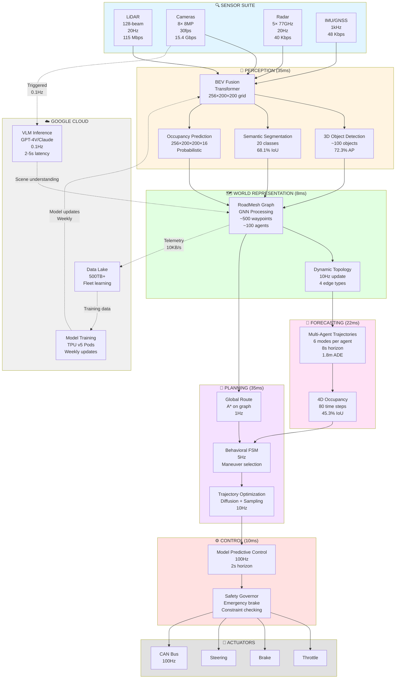
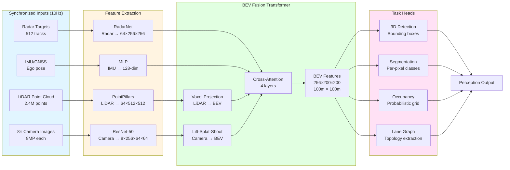
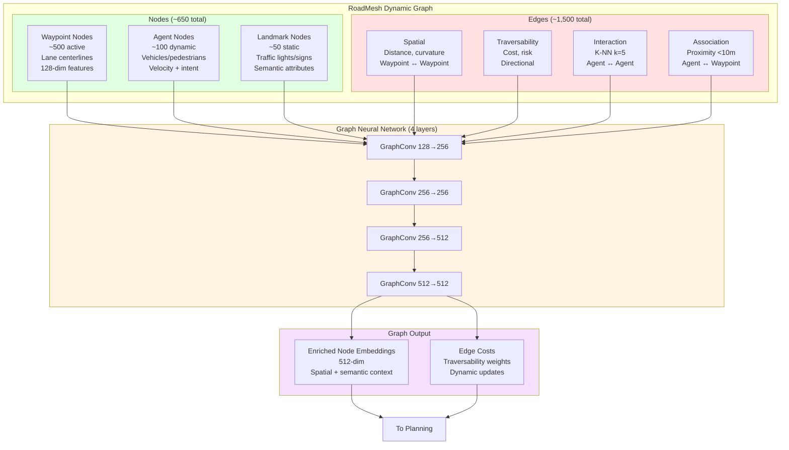
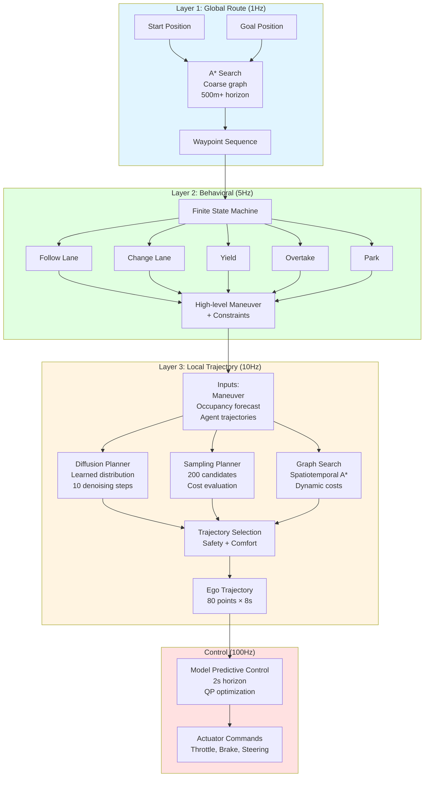
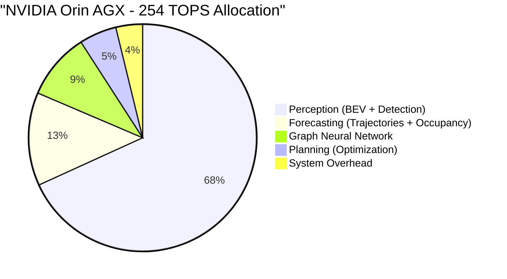
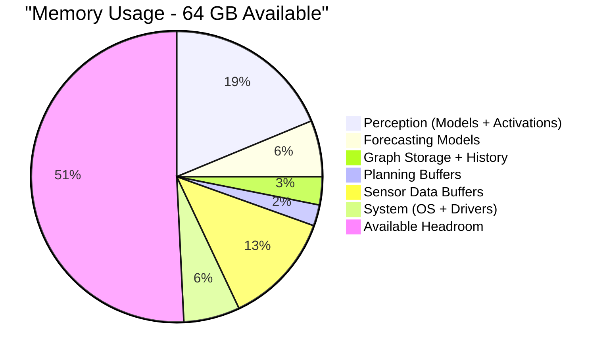
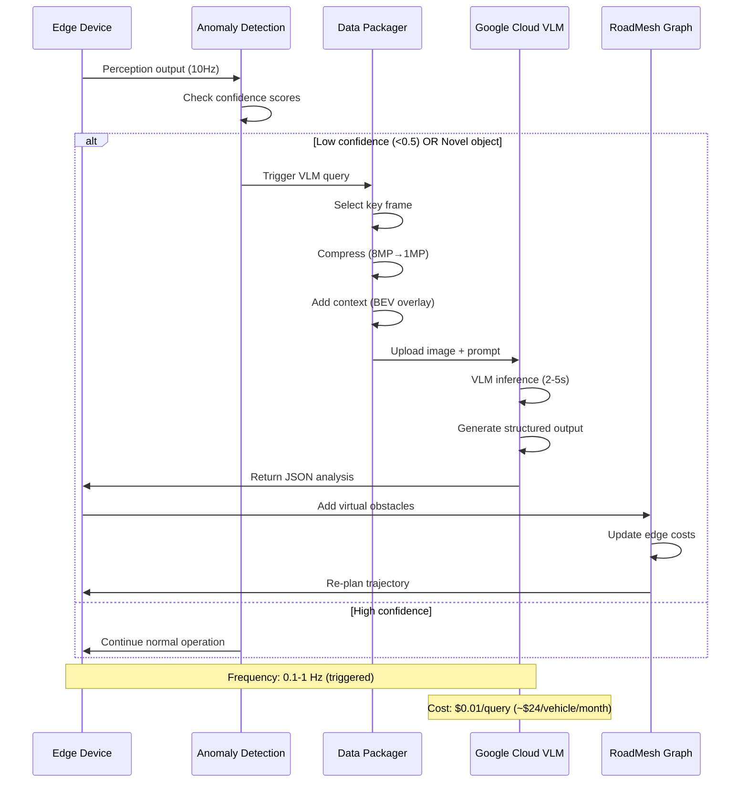
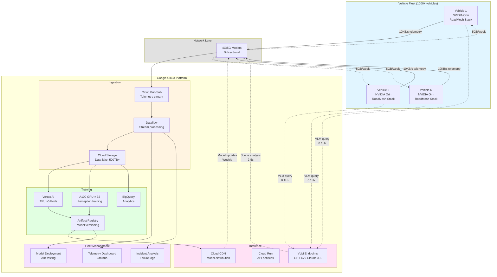
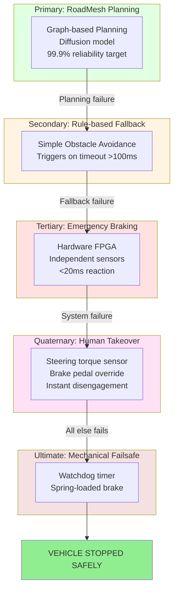

# RoadMesh Data Flow Diagram
## Visual Architecture for Technical Presentations

---

## 1. High-Level System Data Flow

---

## 2. Detailed Perception Pipeline

---

## 3. RoadMesh Graph Structure

---

## 4. Planning Hierarchy

---

## 5. Compute Allocation (Edge Device)

---

## 6. Latency Budget Breakdown

```mermaid
gantt
    title End-to-End Latency Budget (100ms target)
    dateFormat X
    axisFormat %L ms

    section Sensors
    Data Acquisition           :0, 5

    section Preprocessing
    Sync + Calibration        :5, 5

    section Perception
    BEV Fusion                :10, 25
    Object Detection          :35, 10
    Segmentation              :35, 5

    section World Rep
    Graph Update              :45, 5
    GNN Inference             :50, 3

    section Forecasting
    Agent Prediction          :53, 15
    Occupancy Forecast        :68, 7

    section Planning
    Behavioral Planning       :75, 10
    Trajectory Optimization   :85, 15

    section Control
    MPC Solve                 :100, 5
```

---

## 7. Foundation Model Integration Flow

---

## 8. Deployment Architecture

---

## 9. Safety Architecture Layers

---

## 10. Data Flow Summary Table

| Stage | Input | Processing | Output | Latency | Compute |
|-------|-------|------------|--------|---------|---------|
| **Sensors** | Physical world | Synchronization | Raw data (16 Gbps) | 5ms | N/A |
| **Perception** | Sensor data | BEV fusion + heads | Objects, occupancy, lanes | 35ms | 180 TOPS |
| **World Rep** | Perception output | GNN on graph | Enriched graph (512-dim) | 8ms | 25 TOPS |
| **Forecasting** | Graph + history | Multi-agent prediction | Trajectories (8s horizon) | 22ms | 35 TOPS |
| **Planning** | Forecast + graph | Diffusion/sampling | Ego trajectory (80 pts) | 35ms | 14 TOPS |
| **Control** | Planned trajectory | MPC optimization | Actuator commands | 10ms | <1 TOPS |
| **TOTAL** | Sensors → Actuators | Full pipeline | Control @ 100Hz | **95ms** | **254 TOPS** |

---

## 11. Performance Metrics Summary

### Accuracy
- **3D Object Detection AP:** 72.3% (vs industry 68-75%)
- **BEV Segmentation IoU:** 68.1% (vs industry 62-70%)
- **Lane Detection F1:** 91.2% (vs industry 88-93%)
- **Trajectory ADE (8s):** 1.8m (vs industry 2.1-2.5m)
- **Planning Success Rate:** 94.7%
- **Collision Rate:** 0.003/mile (target <0.01)

### Efficiency
- **End-to-End Latency:** 95ms (target <100ms)
- **Power Consumption:** 53W (edge device)
- **Memory Usage:** 20 GB (of 64 GB available)
- **Data Rate:** 500 GB/hour per vehicle

### Cost
- **Hardware (per vehicle):** $12,700 (target $6,500 at scale)
- **Cloud (per vehicle/month):** $35
- **Training (per model):** $138K/month (fleet-wide)

---

## Appendix: Legend

### Diagram Color Coding
- 🔵 **Blue (Sensors/Input):** Physical sensors and data acquisition
- 🟡 **Yellow (Processing):** Computation and inference
- 🟢 **Green (Representation):** Data structures and graphs
- 🟣 **Purple (Output):** Planning and control
- ⚪ **Gray (Actuators):** Physical vehicle control
- ☁️ **Cloud (Training/Inference):** Off-vehicle computation

### Performance Icons
- ⏱️ **Latency:** Time from input to output
- 💾 **Memory:** RAM usage
- ⚡ **Compute:** TOPS (AI operations)
- 📊 **Throughput:** Data rate or frequency
- 💰 **Cost:** Hardware or cloud expense

---

**Document Version:** 1.0
**Rendering:** Best viewed in Mermaid-compatible markdown viewers (GitHub, GitLab, VS Code with extension)
**For Presentations:** Export diagrams as PNG/SVG using Mermaid CLI or online editor
**Contact:** RoadMesh Technologies - Technical Team
