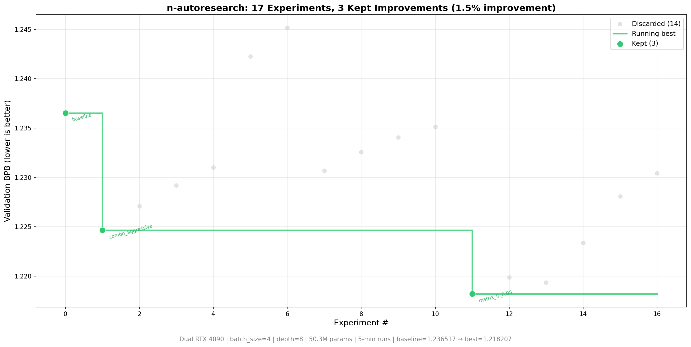

# n-autoresearch



*Above: a 1-hour test run on dual RTX 4090s — 17 experiments, 3 kept improvements, 1.48% val_bpb improvement. Both GPUs running experiments in parallel, batch_size=4, depth=8, 50.3M params. A longer overnight run (8-24h) across more GPUs would find significantly more improvements, same as [karpathy's 2-day run](https://github.com/karpathy/autoresearch) that found 20+ improvements across 276 experiments.*

Same idea as [autoresearch](https://github.com/karpathy/autoresearch) — agent modifies train.py, trains for 5 minutes, keeps or discards, repeats — but with structured experiment state, multi-GPU parallelism, adaptive search, and crash recovery via [iii](https://github.com/iii-hq/iii) (Worker/Function/Trigger). The agent is still external. Claude, Codex, whatever you want. This repo is the infrastructure that replaces the bash loop, git-as-state, and flat TSV with queryable experiment tracking across N GPUs. More GPUs = more parallel experiments = faster research.

## How it works

The repo has three files that matter, same as autoresearch:

- **`prepare.py`** — data prep, tokenizer, eval. Not modified.
- **`train.py`** — model, optimizer, training loop. The agent edits this.
- **`program.md`** — agent instructions. The human edits this.

Two workers talk to iii to provide the infrastructure:

- **Orchestrator** (Python) — 22 functions for experiment tracking, search strategy, GPU pool, reporting.
- **GPU Worker** (Rust) — one per GPU, executes `uv run train.py`, parses metrics, handles timeouts.

The agent calls the same `uv run train.py` but wraps it with REST API calls:

```
POST /api/experiment/setup      — init run tag
POST /api/experiment/register   — record hypothesis before training
POST /api/experiment/complete   — record metrics, auto keep/discard
POST /api/search/suggest        — get guidance on what to try next
POST /api/report/summary        — full stats for a run tag
```

Training runs for a **fixed 5-minute time budget** (wall clock). The metric is **val_bpb** (validation bits per byte) — lower is better, vocab-size-independent so architectural changes are fairly compared.

## Quick start

**Requirements:** NVIDIA GPU(s), Python 3.10+, [uv](https://docs.astral.sh/uv/), Rust 1.82+.

```bash
# 1. Install iii
curl -fsSL https://install.iii.dev/iii/main/install.sh | sh

# 2. Clone and install
git clone https://github.com/iii-hq/n-autoresearch.git
cd n-autoresearch
uv sync

# 3. Download data and train tokenizer (one-time)
uv run prepare.py

# 4. Start iii
iii --config iii-config.yaml

# 5. Start orchestrator (new terminal)
uv run python workers/orchestrator/orchestrator.py

# 6. Start GPU worker (new terminal, one per GPU)
cd workers/gpu
GPU_INDEX=0 REPO_DIR=/path/to/n-autoresearch cargo run --release

# For multiple GPUs:
GPU_INDEX=1 REPO_DIR=/path/to/n-autoresearch cargo run --release

# 7. Point your agent at program.md and go
```

## Running the agent

Point Claude Code, Codex, or any agent at this repo and prompt:

```
Read program.md and kick off a new experiment.
```

The agent loop:

```
1. POST /api/experiment/setup          — init run tag
2. POST /api/search/suggest            — get search guidance
3. edit train.py                       — the experiment
4. git commit
5. POST /api/experiment/register       — record hypothesis
6. uv run train.py > run.log 2>&1     — train (5 min)
7. POST /api/experiment/complete       — record results
   { improved: true,  action: "keep_commit" }
   { improved: false, action: "git_reset" }
8. repeat from 2
```

If training crashes, `POST /api/experiment/crash` tracks consecutive failures and aborts after 3.

## Multi-GPU

N GPU workers = N parallel experiments. Each agent acquires a GPU, trains, records, releases. Search strategy adapts globally across all GPUs.

```bash
curl localhost:3111/api/pool/list
# { "total": 2, "idle": 0, "training": 2 }
```

GPU workers on different machines can point to the same orchestrator:

```bash
# CPU machine (orchestrator)
iii --config iii-config.yaml
uv run python workers/orchestrator/orchestrator.py

# Each GPU machine
III_WS_URL=ws://<orchestrator-ip>:49134 GPU_INDEX=0 cargo run --release
```

Ports 49134 (WebSocket) and 3111 (REST) must be reachable from GPU machines.

## Search adaptation

Strategy auto-adapts after each experiment based on recent history:

```
explore     (default) broad random changes, try underexplored categories
exploit     refine around best config, small incremental tweaks
combine     merge two near-miss experiments that improved different aspects
ablation    systematically remove components to find what matters
```

Transitions:

```
crash rate > 50%                    -> exploit (conservative)
plateau + near-misses available     -> combine
plateau + no near-misses            -> ablation
keep rate > 30%                     -> exploit
default                             -> explore
```

## Project structure

```
prepare.py                              data prep + eval (do not modify)
train.py                                model + optimizer + loop (agent modifies)
program.md                              agent instructions
iii-config.yaml                         iii runtime config
workers/
  orchestrator/
    orchestrator.py                     Python worker — 22 functions, 22 triggers
  gpu/                                  Rust worker (one per GPU)
    src/
      main.rs                           init, GPU detection, pool registration
      config.rs                         env config
      state.rs                          StateKV wrapper
      functions/train.rs                gpu::train + gpu::health
      triggers/mod.rs                   HTTP + cron triggers
```

## Functions (22)

```
experiment::setup           init tag + branch + strategy
experiment::register        record hypothesis before training
experiment::complete        record metrics, auto keep/discard, detect near-misses
experiment::crash           track consecutive crashes, abort after 3
experiment::history         query by tag/status/limit
experiment::best            current best for a tag
experiment::near_misses     experiments within 0.002 BPB of best

search::strategy            get current mode (explore/exploit/combine/ablation)
search::set_strategy        manual override
search::adapt               auto-adapt from experiment history
search::suggest_direction   category stats, underexplored areas, concrete suggestions

pool::register_gpu          GPU worker self-registers on startup
pool::heartbeat             30s heartbeat, offline after 60s stale
pool::list                  all GPUs with status
pool::acquire               atomic claim of idle GPU
pool::release               return GPU to pool
pool::deregister            remove on shutdown

report::summary             full stats, BPB progression, category breakdown
report::tsv                 export in original autoresearch TSV format
report::diff                compare two experiments
report::tags                list all run tags
```

## Design choices

- **Single file to modify.** The agent only touches `train.py`. Diffs are reviewable, scope is manageable.
- **Fixed time budget.** Training always runs for exactly 5 minutes. Experiments are directly comparable regardless of what the agent changes. Autoresearch finds the most optimal model for your platform in that time budget.
- **Structured state.** Experiments, lineage, GPU pool, search strategy all live in iii KV. Queryable, exportable, survives crashes.
- **Multi-GPU native.** N GPUs = N parallel experiments. Atomic GPU acquisition prevents conflicts. Strategy adapts globally.
- **TSV compatibility.** `report::tsv` exports in the original autoresearch format for backwards compatibility.

## Platform notes

Tested on dual RTX 4090 (24GB each). For smaller GPUs:

- Lower `DEPTH` from 8 to 4
- Set `DEVICE_BATCH_SIZE` to 4 (RTX 4090) or 2 (smaller)
- Disable `torch.compile` if compilation OOMs
- Use `WINDOW_PATTERN = "L"` instead of `"SSSL"` if attention is slow

For H100 (80GB), the defaults work as-is.

## License

Apache-2.0
