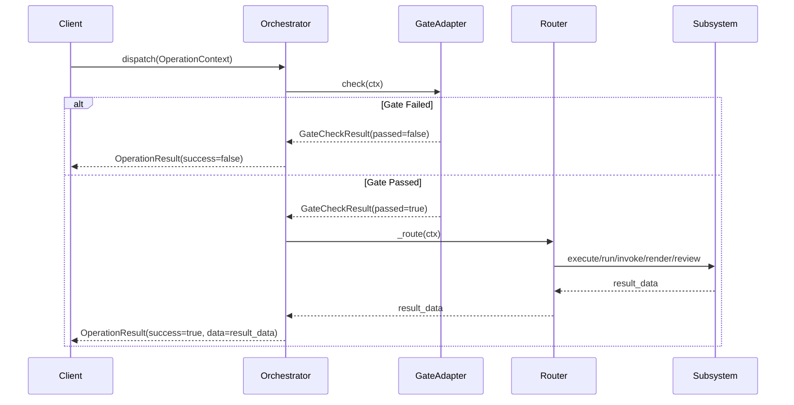

# ShadowTag OS — Package Architecture

> **Version:** 1.0.0  
> **Status:** Hardened (28→33 tests passing)  
> **Package:** `packages/shadowtag_os/`  

---

## 1. Overview

ShadowTag OS is the orchestration layer for the ShadowTag monorepo. It provides a unified dispatch interface that routes operations through a pipeline of pre-flight security gates, sequential kernel chains, HITL (Human-In-The-Loop) judge enforcement, shell automation, dynamic skill discovery, and declarative UI rendering.

```
┌─────────────────────────────────────────────────────────┐
│                   CoreOrchestrator                       │
│  dispatch(ctx) → gate_check → route → result            │
├──────────┬──────────┬──────────┬──────────┬─────────────┤
│ Kernel   │ Judge    │ Skills   │ Zx       │ A2UI        │
│ Chain    │ Adapter  │ Bridge   │ Runner   │ Adapter     │
│ (QUERY/  │ (JUDGE_  │ (SKILL_  │ (SHELL_  │ (UI_       │
│ MUTATION)│ REVIEW)  │ INVOKE)  │ EXEC)    │ RENDER)     │
└──────────┴──────────┴──────────┴──────────┴─────────────┘
```

## 2. Core Components

### 2.1 CoreOrchestrator (`core/orchestrator.py`)

Central dispatch hub. Accepts `OperationContext` and routes to the appropriate subsystem based on `OperationType`.

**6 Operation Types:**

| Type | Router Target | Description |
|------|--------------|-------------|
| `QUERY` | KernelChainAdapter | Read-only data transformations |
| `MUTATION` | KernelChainAdapter | State-changing data operations |
| `SHELL_EXEC` | ZxRunner | Shell command/script execution |
| `UI_RENDER` | A2UIAdapter | Declarative UI component rendering |
| `SKILL_INVOKE` | SkillsBridge | Dynamic capability invocation |
| `JUDGE_REVIEW` | JudgeAdapter | HITL enforcement for high-risk ops |

**Key Design Decisions:**
- Subsystems are **optional** and **lazy-loaded**. Missing subsystems return descriptive errors, not crashes.
- The gate checker runs **before** routing, ensuring all operations are pre-screened.
- Pattern matching (`match/case`) provides exhaustive routing with a catch-all fallback.

### 2.2 GateAdapter (`gates/gate_adapter.py`)

Pre-flight security enforcement layer. Runs 3 gate categories in sequence:

1. **Payload Validation** — Structural check for required fields (`operation_id`, `payload`).
2. **Security Gate** — 26-keyword blocklist covering 6 threat categories:
   - Shell destruction (`rm -rf`, `mkfs.`, `dd if=/dev/zero`, `shred`)
   - Privilege escalation (`sudo`, `su -`, `doas`, `chmod 777`, `chmod +s`)
   - Network exfiltration (`curl | sh`, `wget | sh`, `nc -e`, `mkfifo`)
   - Code injection (`eval(`, `exec(`, `os.system(`, `child_process`, `__import__(`)
   - SQL injection (`DROP TABLE`, `DELETE FROM`, `TRUNCATE TABLE`, `ALTER TABLE DROP`, `UNION SELECT`, `xp_cmdshell`)
   - Destructive I/O (`> /dev/sda`, `rm -f /`)
3. **Custom Gates** — Pluggable callable functions for domain-specific checks.

**Fail-Open Mode:**
- Enabled via `fail_open=True` constructor argument.
- Promotes **non-critical** (`warning` severity) failures to pass.
- **Critical** failures (security, payload) are **never** bypassed.
- Outer exception handler also respects fail-open for unexpected errors.

### 2.3 KernelChainAdapter (`kernels/chain.py`)

Sequential async kernel pipeline.

**Features:**
- Steps execute in order, piping output → input between stages.
- Supports both async and synchronous kernels (sync wrapped via `run_in_executor`).
- SLA enforcement: per-step latency limits with warning logs on breach.
- Audit hashing: SHA-256 composite hash of all step outputs for tamper detection.
- Step failure halts the chain and returns partial results with error context.

**Data Flow:**
```
payload → Step A → output_A → Step B → output_B → ... → ChainResult
           ↓                    ↓
       latency_ms           latency_ms
           ↓                    ↓
      sha256(outputs) ──────→ audit_hash
```

### 2.4 JudgeAdapter (`judges/judge_adapter.py`)

HITL enforcement bridge to `src/judges/`.

**Architecture:**
- Accepts `JUDGE_REVIEW` payloads with `judge_type`, `request_id`, `action_type`, `context`.
- Routes to the correct judge vertical (FinJudge, CaseJudge, LawJudge, FraudJudge) via `JudgeFactory`.
- Synchronous judge execution is wrapped in `asyncio.run_in_executor` to keep the main event loop non-blocking.
- Returns structured decisions with ATP 5-19 risk assessment levels.

**Security Invariant:**  
All `JUDGE_REVIEW` operations produce a binary `ALLOW` or `BLOCK` decision. There is no `WARN`-and-continue path — the orchestrator must respect the verdict.

### 2.5 ZxRunner (`zx_runner/runner.py`)

Shell automation adapter for [google/zx](https://github.com/google/zx).

**Two Execution Modes:**
1. **Command mode** — Direct `asyncio.create_subprocess_shell` for simple commands.
2. **Script mode** — Writes inline script to temp `.mjs` file, executes via `npx zx` or local `zx/build/cli.js`.

**Safety:**
- Timeout enforcement on both modes (default: 30s).
- Temp files are cleaned up in `finally` blocks.
- Structured output capture (`stdout`, `stderr`, `exit_code`).

**Performance Consideration:**  
Script mode has I/O overhead from temp file creation. For hot paths, prefer command mode or pre-write scripts to a persistent location.

### 2.6 SkillsBridge (`skills_bridge/bridge.py`)

Dynamic capability discovery from the [google/skills](https://github.com/google/skills) repository.

**Discovery:**
- Recursively scans `external_repos/skills/` for `SKILL.md` files.
- Parses YAML frontmatter for `name` and `description`.
- Registers skills in an in-memory `dict[str, SkillManifest]`.
- Lazy-loads on first `invoke()` call.

**Performance Consideration:**  
Discovery is O(n) on the number of SKILL.md files. For large skill registries (200+), consider pre-indexing or caching the manifest map to disk.

### 2.7 A2UIAdapter (`a2ui_adapter/adapter.py`)

Declarative UI rendering via [google/A2UI](https://github.com/google/A2UI).

Translates operation payloads into A2UI component trees for agent-to-user interface rendering.

## 3. Data Flow



## 4. Security Model

### 4.1 Defense in Depth

```
Layer 1: GateAdapter (structural + keyword + custom)
  ↓
Layer 2: Operation routing (type-safe match/case)
  ↓
Layer 3: JudgeAdapter (HITL enforcement for JUDGE_REVIEW)
  ↓
Layer 4: Subsystem-level validation (ZxRunner timeouts, etc.)
```

### 4.2 Threat Coverage (26 Keywords)

| Category | Count | Examples |
|----------|-------|---------|
| Shell Destruction | 6 | `rm -rf`, `mkfs.`, `dd if=/dev/zero` |
| Privilege Escalation | 5 | `sudo`, `su -`, `chmod 777` |
| Network Exfiltration | 5 | `curl \| sh`, `nc -e`, `mkfifo` |
| Code Injection | 5 | `eval(`, `exec(`, `os.system(` |
| SQL Injection | 5 | `DROP TABLE`, `TRUNCATE TABLE`, `xp_cmdshell` |

### 4.3 Fail-Open Policy

| Severity | `fail_open=False` | `fail_open=True` |
|----------|-------------------|-------------------|
| `ok` | Pass ✅ | Pass ✅ |
| `warning` | Block ❌ | Pass ✅ (with log) |
| `critical` | Block ❌ | Block ❌ |

## 5. Testing

**33 tests** covering all 6 subsystem routes, gate enforcement, kernel chain behavior, and integration flows.

| Test Class | Count | Coverage |
|------------|-------|----------|
| `TestCoreOrchestratorRouting` | 7 | All 6 op types + counter |
| `TestMissingSubsystems` | 4 | Graceful degradation |
| `TestGateAdapter` | 12 | Payload, security (6 categories), fail-open, custom gates |
| `TestKernelChainAdapter` | 6 | Single/multi/failure/sync/counter |
| `TestIntegration` | 4 | Full pipeline: gate→route→subsystem |

## 6. Package Structure

```
packages/shadowtag_os/
├── __init__.py              # Package exports
├── pyproject.toml            # Package metadata
├── README.md                 # Usage guide
├── DESIGN.md                 # This file
├── core/
│   ├── __init__.py
│   └── orchestrator.py       # CoreOrchestrator, OperationType, OperationContext
├── gates/
│   ├── __init__.py
│   └── gate_adapter.py       # GateAdapter, GateCheckResult
├── kernels/
│   ├── __init__.py
│   └── chain.py              # KernelChainAdapter, ChainStep, ChainResult
├── judges/
│   ├── __init__.py
│   └── judge_adapter.py      # JudgeAdapter (HITL bridge)
├── zx_runner/
│   ├── __init__.py
│   └── runner.py             # ZxRunner, ShellResult
├── skills_bridge/
│   ├── __init__.py
│   └── bridge.py             # SkillsBridge, SkillManifest
├── a2ui_adapter/
│   ├── __init__.py
│   └── adapter.py            # A2UIAdapter
└── tests/
    └── test_orchestrator.py  # 33 integration tests
```

## 7. Performance Considerations

| Component | Bottleneck | Mitigation |
|-----------|-----------|------------|
| ZxRunner (script mode) | Temp file I/O | Use command mode for simple ops |
| SkillsBridge (discovery) | Filesystem walk (O(n) SKILL.md files) | Lazy-load on first invoke; cache manifests |
| JudgeAdapter | `run_in_executor` thread pool | Default pool sufficient; consider bounded pool under load |
| KernelChainAdapter | Sequential step execution | SLA monitoring + early termination on failure |
| GateAdapter (security) | 26-keyword string scan | O(k) where k=26, negligible for typical payloads |

## 8. Dependencies

| Dependency | Purpose | Version |
|-----------|---------|---------|
| `structlog` | Structured logging | ≥24.0 |
| `asyncio` | Async orchestration | stdlib |
| `hashlib` | Audit hashing | stdlib |
| `google/zx` | Shell scripting (external_repos) | latest |
| `google/skills` | Capability registry (external_repos) | latest |
| `google/A2UI` | Declarative UI (external_repos) | latest |
